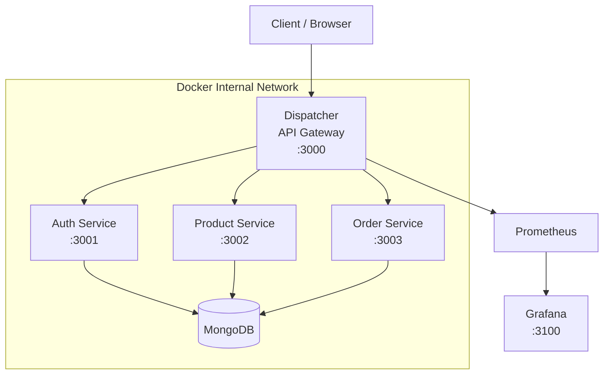
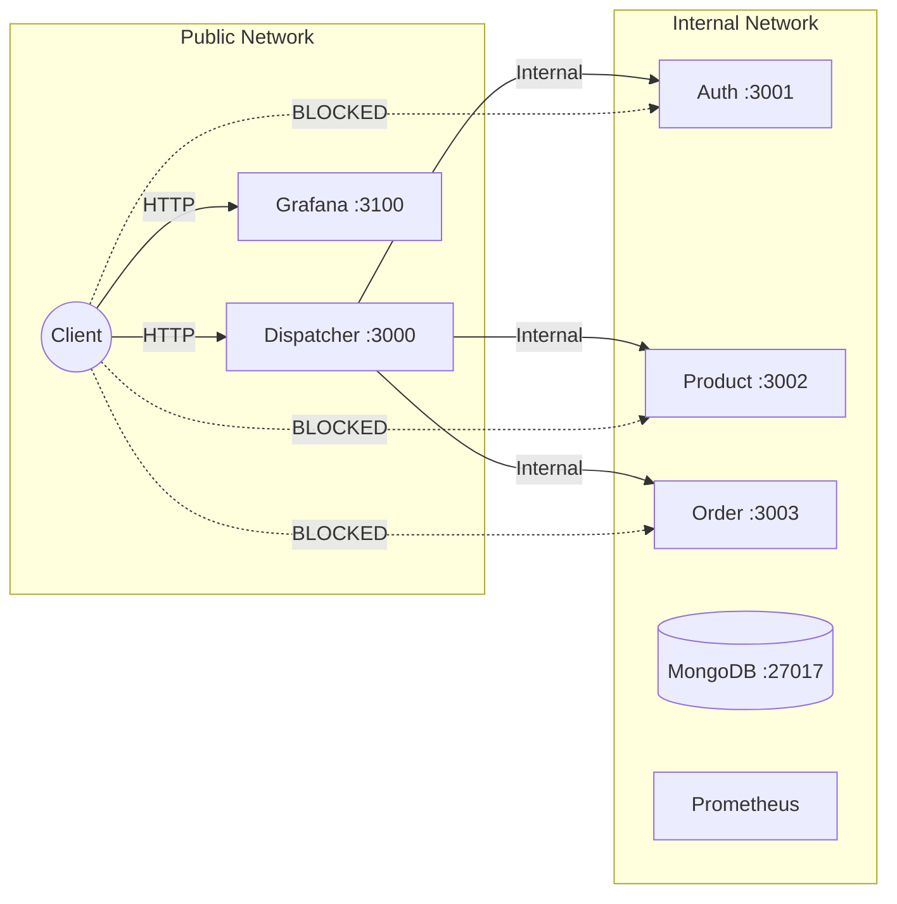
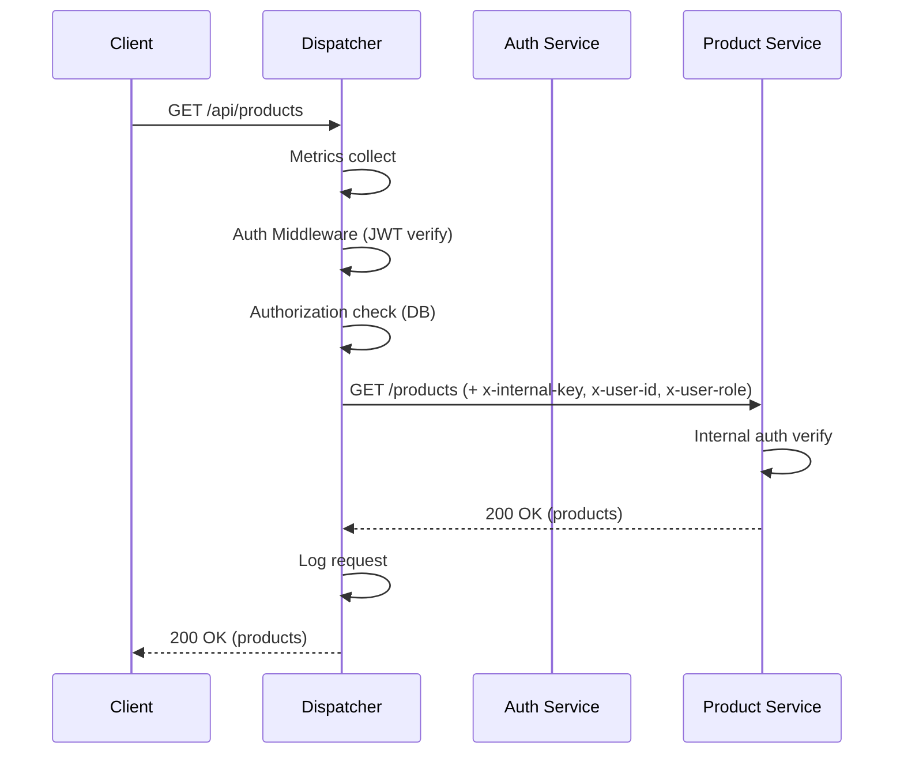
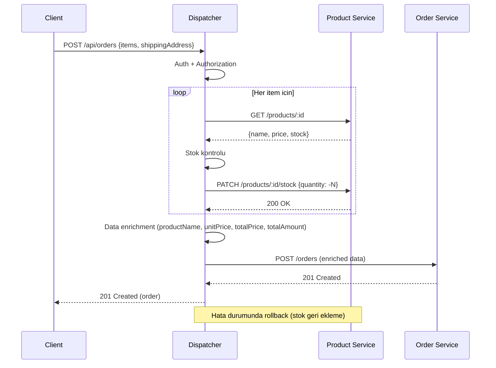
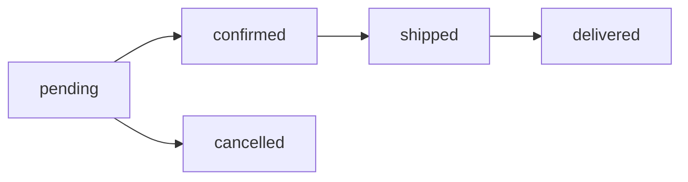
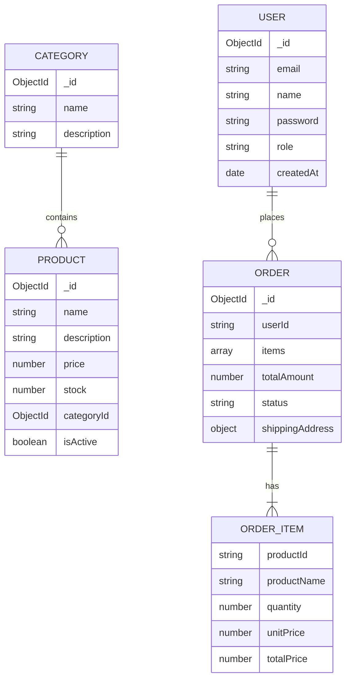

# E-Commerce Gateway

[]()
[]()
[]()
[]()
[]()

## Icindekiler

1. [Kapak](#1-kapak)
2. [Giris](#2-giris)
3. [Teorik Altyapi](#3-teorik-altyapi)
4. [Sistem Tasarimi](#4-sistem-tasarimi)
5. [Proje Yapisi](#5-proje-yapisi)
6. [Test ve Sonuclar](#6-test-ve-sonuclar)
7. [Sonuc ve Tartisma](#7-sonuc-ve-tartisma)
8. [Kaynaklar](#kaynaklar)

---

## 1. Kapak

- **Proje Adi:** E-Commerce Gateway
- **Universite:** Kocaeli Universitesi, Bilisim Sistemleri Muhendisligi
- **Ders:** Yazilim Gelistirme Laboratuvari II
- **Donem:** 2025-2026 Bahar
- **Ekip Uyeleri:**
  - Murat Ozturk
  - Tahsin Oden
- **Tarih:** Nisan 2026

---

## 2. Giris

### Problem Tanimi

Geleneksel monolitik e-ticaret sistemleri, artan kullanici trafigi ve degisen is gereksinimleri karsisinda olceklenme sorunlari yasar. Tek bir kod tabani uzerinde yapilan degisiklikler tum sistemi etkiler, deployment surecleri uzar ve farkli bilesenlerin bagimsiz olarak olceklenmesi mumkun olmaz.

### Proje Amaci

Bu proje, **mikroservis mimarisi** ile modular, olceklenebilir bir e-ticaret sistemi gelistirmeyi amaclamaktadir. Sistem, bir **API Gateway (Dispatcher)** uzerinden yonetilen 4 bagimsiz servisten olusmaktadir.

### Kapsam

- 4 servis: Dispatcher (API Gateway), Auth Service, Product Service, Order Service
- API Gateway pattern ile tek giris noktasi, routing, authentication, authorization ve loglama
- Test Driven Development (TDD) ile gelistirme disiplini
- Docker ile container tabanli deployment ve network izolasyonu
- Prometheus + Grafana ile monitoring
- k6 ile yuk testi

### Hedefler

- Mikroservis mimarisinin avantajlarini pratikte gostermek
- TDD disiplinini 11 cycle boyunca uygulamak (RED → GREEN → REFACTOR)
- API Gateway pattern ile guvenli ve merkezi erisim saglamak
- Network izolasyonu ile mikroservislerin disaridan erisilemez olmasini garantilemek
- Prometheus metrikleri ve Grafana dashboard'lari ile gozlemlenebilirlik saglamak
- k6 yuk testleri ile performans limitlerini olcmek

---

## 3. Teorik Altyapi

### Mikroservis Mimarisi

Mikroservis mimarisi, bir uygulamayi kucuk, bagimsiz servisler koleksiyonu olarak tasarlama yaklisimidir. Her servis kendi veritabani ve is mantigina sahiptir, bagimsiz deploy edilebilir ve farkli teknolojilerle gelistirilebilir.

**Avantajlari:**
- Bagimsiz deployment ve olceklenme
- Teknoloji cesitliligi (polyglot)
- Hata izolasyonu (bir servisin cokmesi tum sistemi etkilemez)
- Ekipler arasi bagimsiz calisma

**Dezavantajlari:**
- Dagitik sistem karmasikligi
- Servisler arasi iletisim maliyeti
- Veri tutarliligi zorlugu
- Operasyonel karmasiklik (monitoring, logging, debugging)

### API Gateway Pattern

API Gateway, tum disaridan gelen isteklerin tek bir noktadan gecmesini saglayan mimari bir kaliptir. Bu proje kapsaminda Dispatcher servisi API Gateway rolunu ustlenmektedir.

Sorumluluklar: routing, authentication (JWT), authorization (role-based), request/response logging, rate limiting, metrics collection ve order orchestration.

### Richardson Maturity Model

| Seviye | Aciklama | Projede Kullanimi |
|--------|----------|-------------------|
| Level 0 | Tek endpoint, tek HTTP metodu | - |
| Level 1 | Kaynak bazli URI'lar | `/api/products`, `/api/orders` |
| Level 2 | HTTP metodlari dogru kullanimda | GET, POST, PUT, PATCH, DELETE |
| Level 3 | HATEOAS (hypermedia) | Gelecek iyilestirme olarak planli |

Bu proje **Level 2** uyumludur.

### REST Prensipleri

- **Client-Server:** Frontend ve backend ayri
- **Stateless:** Her istek kendi basina yeterli (JWT ile)
- **Uniform Interface:** Tutarli URI yapisi ve HTTP metodlari
- **Layered System:** Gateway katmani ile servis izolasyonu

### Test Driven Development (TDD)

TDD, once test yazilip sonra kodun implement edilmesi prensibine dayanir:

1. **RED:** Basarisiz test yaz
2. **GREEN:** Testi gecen minimum kodu yaz
3. **REFACTOR:** Kodu iyilestir, testler hala gecmeli

Bu projede Dispatcher servisi 11 TDD cycle ile gelistirilmistir. Her cycle icin 3 commit atilmistir (test → implementation → refactor).

### Karmasiklik Analizi (Big-O)

| Islem | Zaman Karmasikligi | Aciklama |
|-------|-------------------|----------|
| Urun listeleme (paginated) | O(n) | n = limit, MongoDB cursor |
| Urun arama (text search) | O(n log n) | MongoDB text index |
| Siparis olusturma (orchestration) | O(m) | m = item sayisi, seri stok kontrolu |
| JWT dogrulama | O(1) | Sabit zamanli token verify |
| Rate limiting (sliding window) | O(1) | Map lookup |
| Route eslestirme | O(r) | r = route kural sayisi |

### Literatur Taramasi

1. Newman, S. (2021). *Building Microservices*, 2nd Edition. O'Reilly Media.
2. Richardson, C. (2018). *Microservices Patterns*. Manning Publications.
3. Fowler, M. (2014). "Microservices." martinfowler.com.
4. Beck, K. (2002). *Test Driven Development: By Example*. Addison-Wesley.
5. Fielding, R. (2000). "Architectural Styles and the Design of Network-based Software Architectures." PhD Dissertation, UC Irvine.

---

## 4. Sistem Tasarimi

### 4.1 Genel Mimari



### 4.2 Network Izolasyonu



### 4.3 Proxy Sequence



### 4.4 Order Orchestration Sequence



### 4.5 Class Diagram (Dispatcher)


### 4.6 Siparis Durum Akisi



### 4.7 ER Diyagrami



---

## 5. Proje Yapisi

### Dizin Agaci

```
ecommerce-gateway/
├── docker-compose.yml
├── .gitignore
├── README.md
├── services/
│   ├── dispatcher/          # API Gateway (TDD ile gelistirildi)
│   │   ├── src/
│   │   │   ├── app.ts                    # Composition root
│   │   │   ├── server.ts                 # HTTP server
│   │   │   ├── config/index.ts           # Environment config
│   │   │   ├── middleware/
│   │   │   │   ├── auth.middleware.ts     # JWT authentication
│   │   │   │   ├── authorization.middleware.ts  # Role-based access
│   │   │   │   ├── logging.middleware.ts  # Request/response logging
│   │   │   │   ├── metrics.middleware.ts  # Prometheus metrics
│   │   │   │   ├── proxy.middleware.ts    # Reverse proxy
│   │   │   │   ├── rate-limit.middleware.ts    # Rate limiting
│   │   │   │   └── error-handler.middleware.ts # Global error handler
│   │   │   ├── controllers/
│   │   │   │   ├── health.controller.ts
│   │   │   │   ├── log.controller.ts
│   │   │   │   └── order-orchestration.controller.ts
│   │   │   ├── services/
│   │   │   │   ├── proxy.service.ts
│   │   │   │   ├── service-registry.ts
│   │   │   │   ├── log.service.ts
│   │   │   │   ├── log-query.service.ts
│   │   │   │   └── order-orchestration.service.ts
│   │   │   ├── models/
│   │   │   │   ├── log.model.ts
│   │   │   │   └── route-access-rule.model.ts
│   │   │   ├── utils/
│   │   │   │   ├── errors.ts
│   │   │   │   └── path-matcher.ts
│   │   │   └── interfaces/
│   │   └── tests/
│   │       ├── health.test.ts
│   │       ├── service-registry.test.ts
│   │       ├── proxy.test.ts
│   │       ├── auth.test.ts
│   │       ├── authorization.test.ts
│   │       ├── logging.test.ts
│   │       ├── error-handler.test.ts
│   │       ├── rate-limit.test.ts
│   │       ├── metrics.test.ts
│   │       ├── log-endpoint.test.ts
│   │       └── order-orchestration.test.ts
│   ├── auth-service/        # Kimlik dogrulama servisi
│   ├── product-service/     # Urun yonetimi servisi
│   └── order-service/       # Siparis yonetimi servisi
├── monitoring/
│   ├── prometheus/
│   │   └── prometheus.yml
│   └── grafana/
│       ├── provisioning/
│       │   ├── datasources/prometheus.yml
│       │   └── dashboards/dashboard.yml
│       └── dashboards/
│           ├── traffic-overview.json
│           ├── per-service.json
│           ├── error-analysis.json
│           └── load-test-results.json
├── load-tests/
│   ├── smoke.js
│   ├── load.js
│   ├── stress.js
│   ├── routing-accuracy.js
│   └── README.md
└── scripts/
    └── seed/
```

### Tech Stack

| Bilesen | Teknoloji | Versiyon |
|---------|-----------|----------|
| Runtime | Node.js | 20+ |
| Dil | TypeScript | 5.x |
| Framework | Express.js | 4.x |
| Veritabani | MongoDB | 7.x |
| ODM | Mongoose | 8.x |
| Auth | JWT (jsonwebtoken) | 9.x |
| Test | Jest + Supertest | 29.x |
| Loglama | Winston | 3.x |
| Validasyon | Zod | 3.x |
| Monitoring | Prometheus + Grafana | Latest |
| Yuk Testi | k6 | Latest |
| Container | Docker + docker-compose | Latest |

### Docker Container Yapisi

| Container | Image | Port (Host) | Port (Internal) | Network |
|-----------|-------|-------------|-----------------|---------|
| ecommerce-dispatcher | Custom (Node.js) | 3000 | 3000 | public + internal |
| ecommerce-auth | Custom (Node.js) | - | 3001 | internal |
| ecommerce-product | Custom (Node.js) | - | 3002 | internal |
| ecommerce-order | Custom (Node.js) | - | 3003 | internal |
| ecommerce-mongodb | mongo:7 | - | 27017 | internal |
| ecommerce-prometheus | prom/prometheus | - | 9090 | internal |
| ecommerce-grafana | grafana/grafana | 3100 | 3000 | public + internal |

---

## 6. Test ve Sonuclar

### 6.1 TDD Cycle Tablosu (Dispatcher)

| Cycle | Ozellik | RED Commit | GREEN Commit | REFACTOR Commit |
|-------|---------|------------|--------------|-----------------|
| 1 | Health Check | `de69ab6` test: health check endpoint testleri | `101fafe` feat: health check endpoint implementasyonu | `f2bb75f` refactor: health controller dependency injection |
| 2 | Service Registry | `310c9ec` test: service registry ve route resolution testleri | `f699401` feat: service registry implementasyonu | `bdcb073` refactor: service registry method extraction |
| 3 | Proxy Middleware | `13f2553` test: proxy middleware forwarding testleri | `23e558c` feat: proxy middleware implementasyonu | `c991d2d` refactor: proxy service method extraction ve DI |
| 4 | JWT Authentication | `906c866` test: JWT authentication middleware testleri | `9ae0988` feat: JWT authentication middleware implementasyonu | `afaabdd` refactor: auth middleware method extraction |
| 5 | Authorization | `560fcfb` test: authorization middleware testleri | `61d09ef` feat: authorization middleware implementasyonu | `cd81072` refactor: authorization middleware helper methods |
| 6 | Logging | `4e758c4` test: request/response logging middleware testleri | `406685b` feat: request/response logging implementasyonu | `e2a0130` refactor: logging middleware buildLogData extraction |
| 7 | Error Handler | `58b695f` test: error handler middleware testleri | `4ab44c8` feat: error handler middleware ve custom error siniflari | `13abcc0` refactor: error handler sendErrorResponse extraction |
| 8 | Rate Limiting | `b52e334` test: rate limiting middleware testleri | `826a90a` feat: rate limiting middleware implementasyonu | `77d9c9e` refactor: rate limit static default config |
| 9 | Prometheus Metrics | `19aec06` test: prometheus metrics endpoint testleri | `99bd498` feat: prometheus metrics implementasyonu | `4438fea` refactor: metrics middleware factory methods |
| 10 | Log Endpoint | `f84a944` test: log endpoint (GET /api/logs) testleri | `fe6b12c` feat: log endpoint controller implementasyonu | `c0a5cf9` refactor: log controller query parsing ve helper methods |
| 11 | Order Orchestration | `1727ea6` test: order orchestration testleri | `1d70b89` feat: order orchestration (saga pattern) implementasyonu | `4dcf097` refactor: app.ts final middleware siralamasi ve proxy test izolasyonu |

### 6.2 Test Kapsami

| Servis | Test Sayisi | Coverage |
|--------|------------|----------|
| Dispatcher | 114 | %80+ |
| Auth | 36 | %99 |
| Product | 148 | %99 |
| Order | 78 | %95 |

### 6.3 k6 Yuk Test Senaryolari

| Test | VU | Sure | p(95) Threshold | Hata Orani Threshold |
|------|----|------|-----------------|---------------------|
| Smoke | 5 | 30s | < 500ms | < 1% |
| Load | 50 | 1m | < 1000ms | < 5% |
| Stress | 50→500 | 4.5m | < 3000ms | < 15% |
| Routing Accuracy | 1 | 1 iteration | - | 0% (checks=100%) |

**Smoke Test:** Temel endpoint'lerin (health, register, login, products, categories, orders, metrics) dogru calistigini dogrular.

**Load Test:** 50 sanal kullanici ile 1 dakika boyunca agirlikli rastgele senaryolar calistirir (%30 urun listeleme, %20 urun detay, %15 kategori, %10 siparis olusturma vb.).

**Stress Test:** 50'den 500 VU'ya kademeli ramp-up ile sistemin kirilma noktasini olcer.

**Routing Accuracy:** 20 route kuralinin tamamini tek tek test eder — public endpoint'lerin tokensiz erisilebildigini, protected endpoint'lerin 401 dondugununu, admin endpoint'lerin customer'a 403 dondugununu dogrular.

### 6.4 Grafana Dashboard'lari

4 dashboard otomatik olarak provision edilmektedir:

1. **Traffic Overview** — Requests/sec, Avg Response Time, Error Rate %, Active Connections
2. **Per-Service Metrics** — Servis bazli istek dagilimi, Response Time by Path, Error Rate by Path
3. **Error Analysis** — Status Code Distribution (donut), Error Trend (stacked), Top Error Paths (table), 4xx vs 5xx
4. **Load Test Results** — Request Rate, Latency Percentiles (p50/p95/p99), Error Rate During Load, Active Connections

### 6.5 Network Isolation Kaniti

```bash
# Disaridan mikroservislere erisim denemesi (BASARISIZ OLMALI)
curl http://localhost:3001/health  # Connection refused
curl http://localhost:3002/health  # Connection refused
curl http://localhost:3003/health  # Connection refused

# Dispatcher uzerinden erisim (BASARILI OLMALI)
curl http://localhost:3000/health  # 200 OK

# Docker network inspect
docker network inspect ecommerce-gateway_internal-network
```

### 6.6 API Endpoint Listesi (20 Route)

| # | Path | Method | Auth Level | Aciklama |
|---|------|--------|------------|----------|
| 1 | /health | GET | public | Health check |
| 2 | /api/auth/register | POST | public | Kullanici kaydi |
| 3 | /api/auth/login | POST | public | Giris |
| 4 | /api/auth/profile | GET | protected | Profil bilgisi |
| 5 | /api/products | GET | protected | Urun listesi |
| 6 | /api/products/:id | GET | protected | Urun detayi |
| 7 | /api/products | POST | admin | Urun olustur |
| 8 | /api/products/:id | PUT | admin | Urun guncelle |
| 9 | /api/products/:id | DELETE | admin | Urun sil |
| 10 | /api/categories | GET | protected | Kategori listesi |
| 11 | /api/categories/:id | GET | protected | Kategori detayi |
| 12 | /api/categories | POST | admin | Kategori olustur |
| 13 | /api/categories/:id | PUT | admin | Kategori guncelle |
| 14 | /api/categories/:id | DELETE | admin | Kategori sil |
| 15 | /api/orders | POST | protected | Siparis olustur (orchestrated) |
| 16 | /api/orders | GET | protected | Siparis listesi |
| 17 | /api/orders/:id | GET | protected | Siparis detayi |
| 18 | /api/orders/:id/status | PATCH | protected | Durum guncelle |
| 19 | /api/logs | GET | admin | Istek loglari |
| 20 | /api/metrics | GET | public | Prometheus metrikleri |

### 6.7 Prometheus Metrikleri

| Metrik | Tip | Label'lar | Aciklama |
|--------|-----|-----------|----------|
| `http_requests_total` | Counter | method, path, status_code | Toplam HTTP istek sayisi |
| `http_request_duration_seconds` | Histogram | method, path | Istek suresi (saniye) |
| `http_requests_by_service` | Counter | service, method | Servis bazli istek sayisi |
| `http_errors_total` | Counter | method, path, status_code | Toplam hata sayisi (status >= 400) |
| `active_connections` | Gauge | - | Anlik aktif baglanti sayisi |

---

## 7. Sonuc ve Tartisma

### Basarilanlar

- **4 bagimsiz mikroservis** basariyla gelistirildi ve Docker ile deploy edildi
- **11 TDD cycle** (33 commit) ile Dispatcher servisi disiplinli sekilde gelistirildi
- **API Gateway pattern** ile merkezi authentication, authorization, logging ve rate limiting saglandi
- **Network izolasyonu** ile mikroservislerin disaridan erisilemez olmasi garanti altina alindi
- **Saga pattern** ile order orchestration ve rollback mekanizmasi implement edildi
- **Prometheus + Grafana** ile 4 dashboard uzerinden canli monitoring saglandi
- **k6 ile 4 farkli yuk testi** senaryosu (smoke, load, stress, routing accuracy) hazirlandi

### Karsilasilan Zorluklar

- **Order Orchestration:** Birden fazla servise sirayla istek atip, hata durumunda rollback yapmak karmasik bir saga akisi gerektirdi
- **TDD Disiplini:** Her ozellik icin once test yazma aliskanligi edinmek baslangicta yavaslatici olsa da uzun vadede daha saglam kod uretmeyi sagladi
- **Middleware Pipeline Sirasi:** Auth → Authorization → Logging → Proxy siralamasi kritik onem tasidi; yanlis siralama guvenlik aciklarina yol acabilirdi
- **Docker Network Izolasyonu:** Public ve internal network'lerin dogru yapilandirilmasi deneme-yanilma gerektirdi

### Kisitlamalar

- **HATEOAS (Level 3):** Richardson Maturity Model Level 3 henuz implement edilmedi
- **Caching:** Redis gibi bir cache katmani bulunmuyor; tekrarlayan istekler her seferinde veritabanina gidiyor
- **Message Queue:** Servisler arasi asenkron iletisim icin RabbitMQ/Kafka kullanilmiyor
- **CI/CD:** Otomatik test ve deployment pipeline'i henuz kurulmadi

### Gelecek Iyilestirmeler

- **Redis Cache:** Urun listeleme ve detay endpoint'leri icin cache katmani
- **RabbitMQ/Kafka:** Order orchestration icin event-driven mimari
- **Kubernetes:** Docker Compose yerine Kubernetes ile production-grade orkestrasyon
- **CI/CD Pipeline:** GitHub Actions ile otomatik test, lint ve deployment
- **HATEOAS:** REST Level 3 uyumluluk icin hypermedia linkleri

### Ogrenilenler

- TDD ile yazilan kodun guvenilirliginin geleneksel yaklasima gore belirgin sekilde yuksek oldugu goruldu
- Mikroservis mimarisinin basitlik/karmasiklik dengesinin dogru kurulmasi gerektigini ogrendik
- Docker networking ile gercek dunya senaryolarinda network izolasyonunun nasil saglandigini deneyimledik
- Prometheus + Grafana kombinasyonunun uretim ortaminda gozlemlenebilirlik icin ne kadar guclu oldugunu gordul

---

## Kaynaklar

1. Newman, S. (2021). *Building Microservices*, 2nd Edition. O'Reilly Media.
2. Richardson, C. (2018). *Microservices Patterns*. Manning Publications.
3. Fowler, M. (2014). "Microservices." martinfowler.com.
4. Beck, K. (2002). *Test Driven Development: By Example*. Addison-Wesley.
5. Fielding, R. T. (2000). "Architectural Styles and the Design of Network-based Software Architectures." PhD Dissertation, University of California, Irvine.
6. Richardson, L. & Ruby, S. (2013). *RESTful Web APIs*. O'Reilly Media.
7. Sadalage, P. J. & Fowler, M. (2012). *NoSQL Distilled*. Addison-Wesley.
8. Martin, R. C. (2008). *Clean Code: A Handbook of Agile Software Craftsmanship*. Prentice Hall.
9. Kleppmann, M. (2017). *Designing Data-Intensive Applications*. O'Reilly Media.
10. Burns, B. (2018). *Designing Distributed Systems*. O'Reilly Media.
