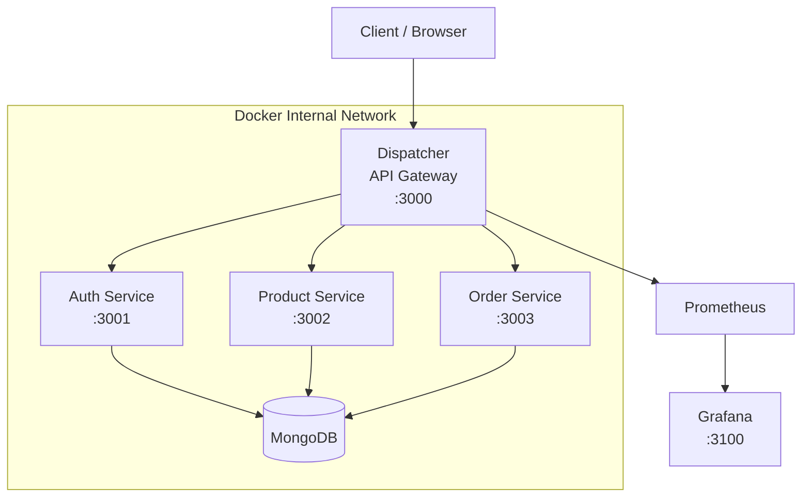
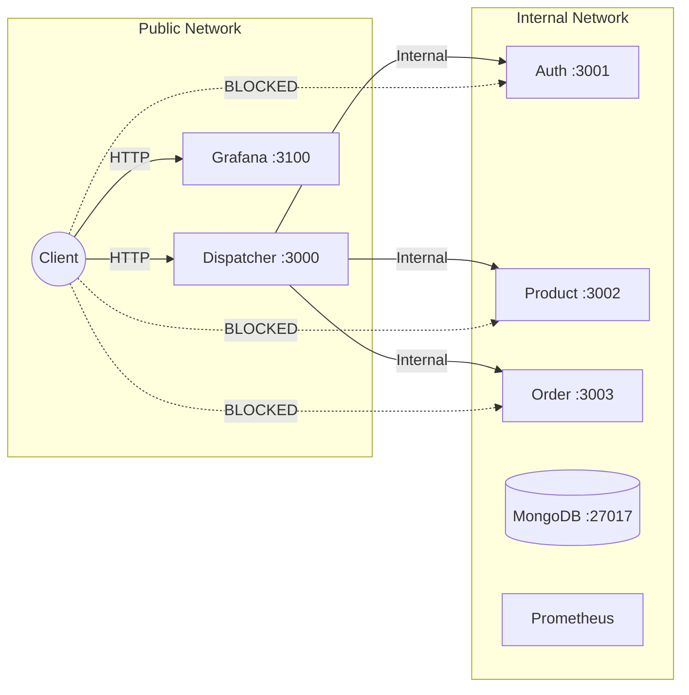
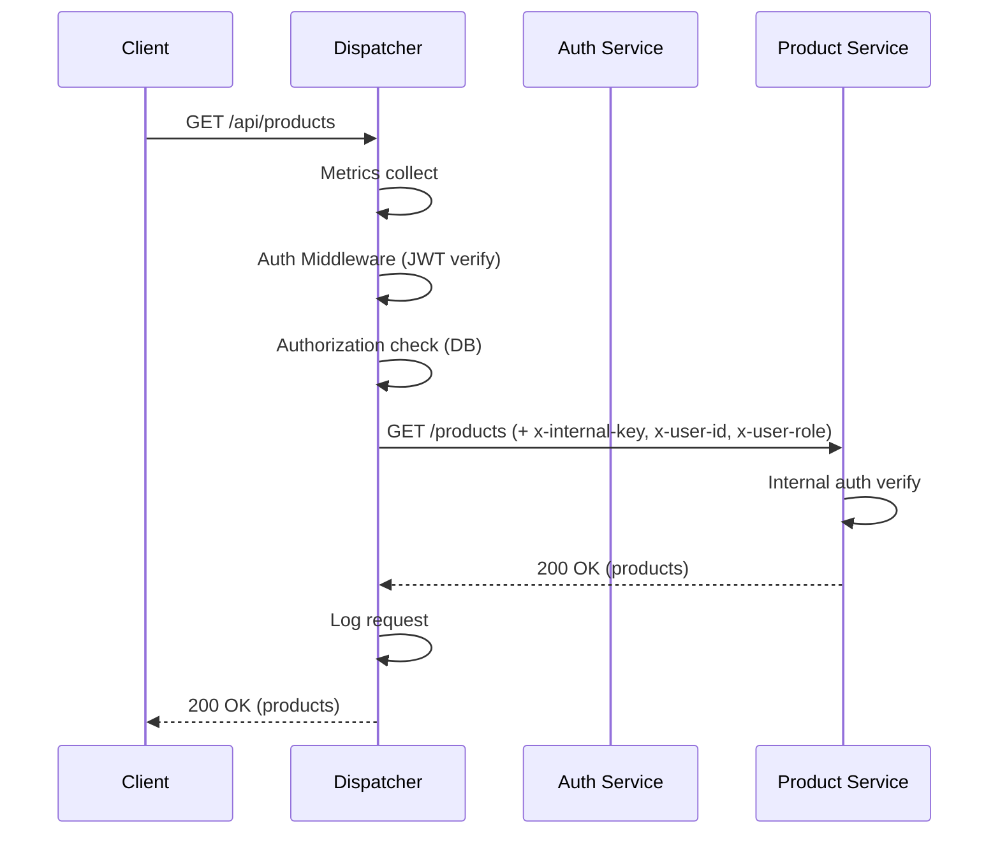
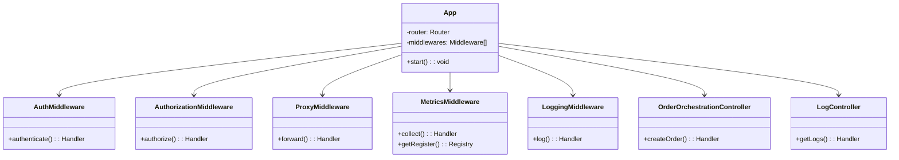
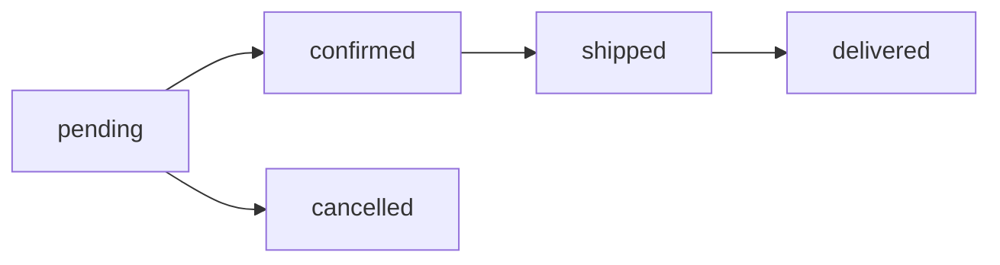
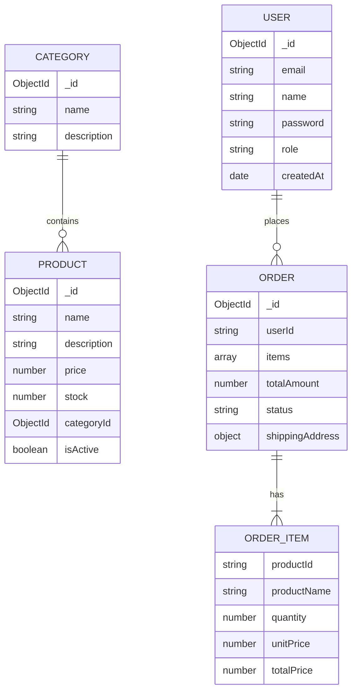

# E-Commerce Gateway

[]()
[]()
[]()
[]()
[]()

## İçindekiler

1. [Kapak](#1-kapak)
2. [Giriş](#2-giriş)
3. [Teorik Altyapı](#3-teorik-altyapı)
4. [Sistem Tasarımı](#4-sistem-tasarımı)
5. [Proje Yapısı](#5-proje-yapısı)
6. [Test ve Sonuçlar](#6-test-ve-sonuçlar)
7. [Sonuç ve Tartışma](#7-sonuç-ve-tartışma)
8. [Kaynaklar](#kaynaklar)

---

## 1. Kapak

- **Proje Adı:** E-Commerce Gateway
- **Üniversite:** Kocaeli Üniversitesi, Bilişim Sistemleri Mühendisliği
- **Ders:** Yazılım Geliştirme Laboratuvarı II
- **Dönem:** 2025-2026 Bahar
- **Ekip Üyeleri:**
  - Murat Öztürk
  - Ahmet Tahsin Söylemez
- **Tarih:** Nisan 2026

---

## 2. Giriş

### Problem Tanımı

Geleneksel monolitik e-ticaret sistemleri, artan kullanıcı trafiği ve değişen iş gereksinimleri karşısında ölçeklenme sorunları yaşar. Tek bir kod tabanı üzerinde yapılan değişiklikler tüm sistemi etkiler, deployment süreçleri uzar ve farklı bileşenlerin bağımsız olarak ölçeklenmesi mümkün olmaz.

### Proje Amacı

Bu proje, **mikroservis mimarisi** ile modüler, ölçeklenebilir bir e-ticaret sistemi geliştirmeyi amaçlamaktadır. Sistem, bir **API Gateway (Dispatcher)** üzerinden yönetilen 4 bağımsız servisten oluşmaktadır.

### Kapsam

- 4 servis: Dispatcher (API Gateway), Auth Service, Product Service, Order Service
- API Gateway pattern ile tek giriş noktası, routing, authentication, authorization ve loglama
- Test Driven Development (TDD) ile geliştirme disiplini
- Docker ile container tabanlı deployment ve network izolasyonu
- Prometheus + Grafana ile monitoring
- k6 ile yük testi

### Hedefler

- Mikroservis mimarisinin avantajlarını pratikte göstermek
- TDD disiplinini 11 cycle boyunca uygulamak (RED → GREEN → REFACTOR)
- API Gateway pattern ile güvenli ve merkezi erişim sağlamak
- Network izolasyonu ile mikroservislerin dışarıdan erişilemez olmasını garantilemek
- Prometheus metrikleri ve Grafana dashboard'ları ile gözlemlenebilirlik sağlamak
- k6 yük testleri ile performans limitlerini ölçmek

---

## 3. Teorik Altyapı

### Mikroservis Mimarisi

Mikroservis mimarisi, bir uygulamayı küçük, bağımsız servisler koleksiyonu olarak tasarlama yaklaşımıdır. Her servis kendi veritabanı ve iş mantığına sahiptir, bağımsız deploy edilebilir ve farklı teknolojilerle geliştirilebilir.

**Avantajları:**
- Bağımsız deployment ve ölçeklenme
- Teknoloji çeşitliliği (polyglot)
- Hata izolasyonu (bir servisin çökmesi tüm sistemi etkilemez)
- Ekipler arası bağımsız çalışma

**Dezavantajları:**
- Dağıtık sistem karmaşıklığı
- Servisler arası iletişim maliyeti
- Veri tutarlılığı zorluğu
- Operasyonel karmaşıklık (monitoring, logging, debugging)

### API Gateway Pattern

API Gateway, tüm dışarıdan gelen isteklerin tek bir noktadan geçmesini sağlayan mimari bir kalıptır. Bu proje kapsamında Dispatcher servisi API Gateway rolünü üstlenmektedir.

Sorumluluklar: routing, authentication (JWT), authorization (role-based), request/response logging, rate limiting, metrics collection ve order orchestration.

### Richardson Maturity Model

| Seviye | Açıklama | Projede Kullanımı |
|--------|----------|-------------------|
| Level 0 | Tek endpoint, tek HTTP metodu | - |
| Level 1 | Kaynak bazlı URI'lar | `/api/products`, `/api/orders` |
| Level 2 | HTTP metodları doğru kullanımda | GET, POST, PUT, PATCH, DELETE |
| Level 3 | HATEOAS (hypermedia) | Gelecek iyileştirme olarak planlı |

Bu proje **Level 2** uyumludur.

### REST Prensipleri

- **Client-Server:** Frontend ve backend ayrı
- **Stateless:** Her istek kendi başına yeterli (JWT ile)
- **Uniform Interface:** Tutarlı URI yapısı ve HTTP metodları
- **Layered System:** Gateway katmanı ile servis izolasyonu

### Test Driven Development (TDD)

TDD, önce test yazılıp sonra kodun implement edilmesi prensibine dayanır:

1. **RED:** Başarısız test yaz
2. **GREEN:** Testi geçen minimum kodu yaz
3. **REFACTOR:** Kodu iyileştir, testler hâlâ geçmeli

Bu projede Dispatcher servisi 11 TDD cycle ile geliştirilmiştir. Her cycle için 3 commit atılmıştır (test → implementation → refactor).

### Karmaşıklık Analizi (Big-O)

| İşlem | Zaman Karmaşıklığı | Açıklama |
|-------|-------------------|----------|
| Ürün listeleme (paginated) | O(n) | n = limit, MongoDB cursor |
| Ürün arama (text search) | O(n log n) | MongoDB text index |
| Sipariş oluşturma (orchestration) | O(m) | m = item sayısı, seri stok kontrolü |
| JWT doğrulama | O(1) | Sabit zamanlı token verify |
| Rate limiting (sliding window) | O(1) | Map lookup |
| Route eşleştirme | O(r) | r = route kural sayısı |

### Literatür Taraması

1. Newman, S. (2021). *Building Microservices*, 2nd Edition. O'Reilly Media.
2. Richardson, C. (2018). *Microservices Patterns*. Manning Publications.
3. Fowler, M. (2014). "Microservices." martinfowler.com.
4. Beck, K. (2002). *Test Driven Development: By Example*. Addison-Wesley.
5. Fielding, R. (2000). "Architectural Styles and the Design of Network-based Software Architectures." PhD Dissertation, UC Irvine.

---

## 4. Sistem Tasarımı

### 4.1 Genel Mimari



### 4.2 Network İzolasyonu



### 4.3 Proxy Sequence



### 4.4 Order Orchestration Sequence


### 4.5 Class Diagram (Dispatcher)



### 4.6 Sipariş Durum Akışı



### 4.7 ER Diyagramı



---

## 5. Proje Yapısı

### Dizin Ağacı

```
ecommerce-gateway/
├── docker-compose.yml
├── .gitignore
├── README.md
├── services/
│   ├── dispatcher/          # API Gateway (TDD ile geliştirildi)
│   │   ├── src/
│   │   │   ├── app.ts                    # Composition root
│   │   │   ├── server.ts                 # HTTP server
│   │   │   ├── config/index.ts           # Environment config
│   │   │   ├── middleware/
│   │   │   │   ├── auth.middleware.ts     # JWT authentication
│   │   │   │   ├── authorization.middleware.ts  # Role-based access
│   │   │   │   ├── logging.middleware.ts  # Request/response logging
│   │   │   │   ├── metrics.middleware.ts  # Prometheus metrics
│   │   │   │   ├── proxy.middleware.ts    # Reverse proxy
│   │   │   │   ├── rate-limit.middleware.ts    # Rate limiting
│   │   │   │   └── error-handler.middleware.ts # Global error handler
│   │   │   ├── controllers/
│   │   │   │   ├── health.controller.ts
│   │   │   │   ├── log.controller.ts
│   │   │   │   └── order-orchestration.controller.ts
│   │   │   ├── services/
│   │   │   │   ├── proxy.service.ts
│   │   │   │   ├── service-registry.ts
│   │   │   │   ├── log.service.ts
│   │   │   │   ├── log-query.service.ts
│   │   │   │   └── order-orchestration.service.ts
│   │   │   ├── models/
│   │   │   │   ├── log.model.ts
│   │   │   │   └── route-access-rule.model.ts
│   │   │   ├── utils/
│   │   │   │   ├── errors.ts
│   │   │   │   └── path-matcher.ts
│   │   │   └── interfaces/
│   │   └── tests/
│   │       ├── health.test.ts
│   │       ├── service-registry.test.ts
│   │       ├── proxy.test.ts
│   │       ├── auth.test.ts
│   │       ├── authorization.test.ts
│   │       ├── logging.test.ts
│   │       ├── error-handler.test.ts
│   │       ├── rate-limit.test.ts
│   │       ├── metrics.test.ts
│   │       ├── log-endpoint.test.ts
│   │       └── order-orchestration.test.ts
│   ├── auth-service/        # Kimlik doğrulama servisi
│   ├── product-service/     # Ürün yönetimi servisi
│   └── order-service/       # Sipariş yönetimi servisi
├── monitoring/
│   ├── prometheus/
│   │   └── prometheus.yml
│   └── grafana/
│       ├── provisioning/
│       │   ├── datasources/prometheus.yml
│       │   └── dashboards/dashboard.yml
│       └── dashboards/
│           ├── traffic-overview.json
│           ├── per-service.json
│           ├── error-analysis.json
│           └── load-test-results.json
├── load-tests/
│   ├── smoke.js
│   ├── load.js
│   ├── stress.js
│   ├── routing-accuracy.js
│   └── README.md
└── scripts/
    └── seed/
```

### Tech Stack

| Bileşen | Teknoloji | Versiyon |
|---------|-----------|----------|
| Runtime | Node.js | 20+ |
| Dil | TypeScript | 5.x |
| Framework | Express.js | 4.x |
| Veritabanı | MongoDB | 7.x |
| ODM | Mongoose | 8.x |
| Auth | JWT (jsonwebtoken) | 9.x |
| Test | Jest + Supertest | 29.x |
| Loglama | Winston | 3.x |
| Validasyon | Zod | 3.x |
| Monitoring | Prometheus + Grafana | Latest |
| Yük Testi | k6 | Latest |
| Container | Docker + docker-compose | Latest |

### Docker Container Yapısı

| Container | Image | Port (Host) | Port (Internal) | Network |
|-----------|-------|-------------|-----------------|---------|
| ecommerce-dispatcher | Custom (Node.js) | 3000 | 3000 | public + internal |
| ecommerce-auth | Custom (Node.js) | - | 3001 | internal |
| ecommerce-product | Custom (Node.js) | - | 3002 | internal |
| ecommerce-order | Custom (Node.js) | - | 3003 | internal |
| ecommerce-mongodb | mongo:7 | - | 27017 | internal |
| ecommerce-prometheus | prom/prometheus | - | 9090 | internal |
| ecommerce-grafana | grafana/grafana | 3100 | 3000 | public + internal |

---

## 6. Test ve Sonuçlar

### 6.1 TDD Cycle Tablosu (Dispatcher)

| Cycle | Özellik | RED Commit | GREEN Commit | REFACTOR Commit |
|-------|---------|------------|--------------|-----------------|
| 1 | Health Check | `de69ab6` test: health check endpoint testleri | `101fafe` feat: health check endpoint implementasyonu | `f2bb75f` refactor: health controller dependency injection |
| 2 | Service Registry | `310c9ec` test: service registry ve route resolution testleri | `f699401` feat: service registry implementasyonu | `bdcb073` refactor: service registry method extraction |
| 3 | Proxy Middleware | `13f2553` test: proxy middleware forwarding testleri | `23e558c` feat: proxy middleware implementasyonu | `c991d2d` refactor: proxy service method extraction ve DI |
| 4 | JWT Authentication | `906c866` test: JWT authentication middleware testleri | `9ae0988` feat: JWT authentication middleware implementasyonu | `afaabdd` refactor: auth middleware method extraction |
| 5 | Authorization | `560fcfb` test: authorization middleware testleri | `61d09ef` feat: authorization middleware implementasyonu | `cd81072` refactor: authorization middleware helper methods |
| 6 | Logging | `4e758c4` test: request/response logging middleware testleri | `406685b` feat: request/response logging implementasyonu | `e2a0130` refactor: logging middleware buildLogData extraction |
| 7 | Error Handler | `58b695f` test: error handler middleware testleri | `4ab44c8` feat: error handler middleware ve custom error sınıfları | `13abcc0` refactor: error handler sendErrorResponse extraction |
| 8 | Rate Limiting | `b52e334` test: rate limiting middleware testleri | `826a90a` feat: rate limiting middleware implementasyonu | `77d9c9e` refactor: rate limit static default config |
| 9 | Prometheus Metrics | `19aec06` test: prometheus metrics endpoint testleri | `99bd498` feat: prometheus metrics implementasyonu | `4438fea` refactor: metrics middleware factory methods |
| 10 | Log Endpoint | `f84a944` test: log endpoint (GET /api/logs) testleri | `fe6b12c` feat: log endpoint controller implementasyonu | `c0a5cf9` refactor: log controller query parsing ve helper methods |
| 11 | Order Orchestration | `1727ea6` test: order orchestration testleri | `1d70b89` feat: order orchestration (saga pattern) implementasyonu | `4dcf097` refactor: app.ts final middleware sıralaması ve proxy test izolasyonu |

### 6.2 Test Kapsamı

| Servis | Test Sayısı | Coverage |
|--------|------------|----------|
| Dispatcher | 114 | %80+ |
| Auth | 36 | %99 |
| Product | 148 | %99 |
| Order | 78 | %95 |

### 6.3 k6 Yük Test Senaryoları

| Test | VU | Süre | p(95) Threshold | Hata Oranı Threshold |
|------|----|------|-----------------|---------------------|
| Smoke | 5 | 30s | < 500ms | < 1% |
| Load | 50 | 1m | < 1000ms | < 5% |
| Stress | 50→500 | 4.5m | < 3000ms | < 15% |
| Routing Accuracy | 1 | 1 iteration | - | 0% (checks=100%) |

**Smoke Test:** Temel endpoint'lerin (health, register, login, products, categories, orders, metrics) doğru çalıştığını doğrular.

**Load Test:** 50 sanal kullanıcı ile 1 dakika boyunca ağırlıklı rastgele senaryolar çalıştırır (%30 ürün listeleme, %20 ürün detay, %15 kategori, %10 sipariş oluşturma vb.).

**Stress Test:** 50'den 500 VU'ya kademeli ramp-up ile sistemin kırılma noktasını ölçer.

**Routing Accuracy:** 20 route kuralının tamamını tek tek test eder — public endpoint'lerin tokensız erişilebildiğini, protected endpoint'lerin 401 döndüğünü, admin endpoint'lerin customer'a 403 döndüğünü doğrular.

### 6.4 Grafana Dashboard'ları

4 dashboard otomatik olarak provision edilmektedir:

1. **Traffic Overview** — Requests/sec, Avg Response Time, Error Rate %, Active Connections
2. **Per-Service Metrics** — Servis bazlı istek dağılımı, Response Time by Path, Error Rate by Path
3. **Error Analysis** — Status Code Distribution (donut), Error Trend (stacked), Top Error Paths (table), 4xx vs 5xx
4. **Load Test Results** — Request Rate, Latency Percentiles (p50/p95/p99), Error Rate During Load, Active Connections

### 6.5 Network İzolasyon Kanıtı

```bash
# Dışarıdan mikroservislere erişim denemesi (BAŞARISIZ OLMALI)
curl http://localhost:3001/health  # Connection refused
curl http://localhost:3002/health  # Connection refused
curl http://localhost:3003/health  # Connection refused

# Dispatcher üzerinden erişim (BAŞARILI OLMALI)
curl http://localhost:3000/health  # 200 OK

# Docker network inspect
docker network inspect ecommerce-gateway_internal-network
```

### 6.6 API Endpoint Listesi (20 Route)

| # | Path | Method | Auth Level | Açıklama |
|---|------|--------|------------|----------|
| 1 | /health | GET | public | Health check |
| 2 | /api/auth/register | POST | public | Kullanıcı kaydı |
| 3 | /api/auth/login | POST | public | Giriş |
| 4 | /api/auth/profile | GET | protected | Profil bilgisi |
| 5 | /api/products | GET | protected | Ürün listesi |
| 6 | /api/products/:id | GET | protected | Ürün detayı |
| 7 | /api/products | POST | admin | Ürün oluştur |
| 8 | /api/products/:id | PUT | admin | Ürün güncelle |
| 9 | /api/products/:id | DELETE | admin | Ürün sil |
| 10 | /api/categories | GET | protected | Kategori listesi |
| 11 | /api/categories/:id | GET | protected | Kategori detayı |
| 12 | /api/categories | POST | admin | Kategori oluştur |
| 13 | /api/categories/:id | PUT | admin | Kategori güncelle |
| 14 | /api/categories/:id | DELETE | admin | Kategori sil |
| 15 | /api/orders | POST | protected | Sipariş oluştur (orchestrated) |
| 16 | /api/orders | GET | protected | Sipariş listesi |
| 17 | /api/orders/:id | GET | protected | Sipariş detayı |
| 18 | /api/orders/:id/status | PATCH | protected | Durum güncelle |
| 19 | /api/logs | GET | admin | İstek logları |
| 20 | /api/metrics | GET | public | Prometheus metrikleri |

### 6.7 Prometheus Metrikleri

| Metrik | Tip | Label'lar | Açıklama |
|--------|-----|-----------|----------|
| `http_requests_total` | Counter | method, path, status_code | Toplam HTTP istek sayısı |
| `http_request_duration_seconds` | Histogram | method, path | İstek süresi (saniye) |
| `http_requests_by_service` | Counter | service, method | Servis bazlı istek sayısı |
| `http_errors_total` | Counter | method, path, status_code | Toplam hata sayısı (status >= 400) |
| `active_connections` | Gauge | - | Anlık aktif bağlantı sayısı |

---

## 7. Sonuç ve Tartışma

### Başarılanlar

- **4 bağımsız mikroservis** başarıyla geliştirildi ve Docker ile deploy edildi
- **11 TDD cycle** (33 commit) ile Dispatcher servisi disiplinli şekilde geliştirildi
- **API Gateway pattern** ile merkezi authentication, authorization, logging ve rate limiting sağlandı
- **Network izolasyonu** ile mikroservislerin dışarıdan erişilemez olması garanti altına alındı
- **Saga pattern** ile order orchestration ve rollback mekanizması implement edildi
- **Prometheus + Grafana** ile 4 dashboard üzerinden canlı monitoring sağlandı
- **k6 ile 4 farklı yük testi** senaryosu (smoke, load, stress, routing accuracy) hazırlandı

### Karşılaşılan Zorluklar

- **Order Orchestration:** Birden fazla servise sırayla istek atıp, hata durumunda rollback yapmak karmaşık bir saga akışı gerektirdi
- **TDD Disiplini:** Her özellik için önce test yazma alışkanlığı edinmek başlangıçta yavaşlatıcı olsa da uzun vadede daha sağlam kod üretmeyi sağladı
- **Middleware Pipeline Sırası:** Auth → Authorization → Logging → Proxy sıralaması kritik önem taşıdı; yanlış sıralama güvenlik açıklarına yol açabilirdi
- **Docker Network İzolasyonu:** Public ve internal network'lerin doğru yapılandırılması deneme-yanılma gerektirdi

### Kısıtlamalar

- **HATEOAS (Level 3):** Richardson Maturity Model Level 3 henüz implement edilmedi
- **Caching:** Redis gibi bir cache katmanı bulunmuyor; tekrarlayan istekler her seferinde veritabanına gidiyor
- **Message Queue:** Servisler arası asenkron iletişim için RabbitMQ/Kafka kullanılmıyor
- **CI/CD:** Otomatik test ve deployment pipeline'ı henüz kurulmadı

### Gelecek İyileştirmeler

- **Redis Cache:** Ürün listeleme ve detay endpoint'leri için cache katmanı
- **RabbitMQ/Kafka:** Order orchestration için event-driven mimari
- **Kubernetes:** Docker Compose yerine Kubernetes ile production-grade orkestrasyon
- **CI/CD Pipeline:** GitHub Actions ile otomatik test, lint ve deployment
- **HATEOAS:** REST Level 3 uyumluluk için hypermedia linkleri

### Öğrenilenler

- TDD ile yazılan kodun güvenilirliğinin geleneksel yaklaşıma göre belirgin şekilde yüksek olduğu görüldü
- Mikroservis mimarisinin basitlik/karmaşıklık dengesinin doğru kurulması gerektiğini öğrendik
- Docker networking ile gerçek dünya senaryolarında network izolasyonunun nasıl sağlandığını deneyimledik
- Prometheus + Grafana kombinasyonunun üretim ortamında gözlemlenebilirlik için ne kadar güçlü olduğunu gördük

---

## Kaynaklar

1. Newman, S. (2021). *Building Microservices*, 2nd Edition. O'Reilly Media.
2. Richardson, C. (2018). *Microservices Patterns*. Manning Publications.
3. Fowler, M. (2014). "Microservices." martinfowler.com.
4. Beck, K. (2002). *Test Driven Development: By Example*. Addison-Wesley.
5. Fielding, R. T. (2000). "Architectural Styles and the Design of Network-based Software Architectures." PhD Dissertation, University of California, Irvine.
6. Richardson, L. & Ruby, S. (2013). *RESTful Web APIs*. O'Reilly Media.
7. Sadalage, P. J. & Fowler, M. (2012). *NoSQL Distilled*. Addison-Wesley.
8. Martin, R. C. (2008). *Clean Code: A Handbook of Agile Software Craftsmanship*. Prentice Hall.
9. Kleppmann, M. (2017). *Designing Data-Intensive Applications*. O'Reilly Media.
10. Burns, B. (2018). *Designing Distributed Systems*. O'Reilly Media.
