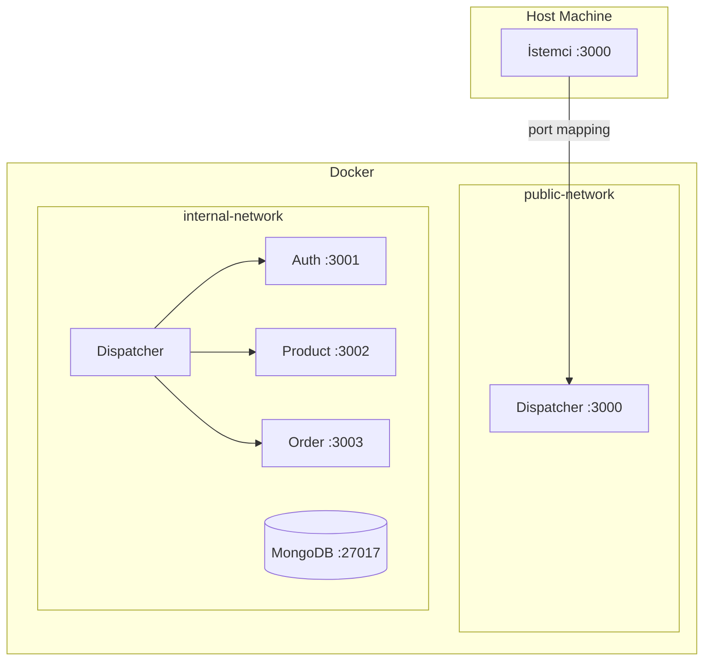

# ADR-004: Docker Network Isolation

**Date:** 2026-03-20
**Status:** Kabul Edildi

## Bağlam

Proje gereksinimleri network isolation zorunlu kılıyor: mikroservisler sadece iç ağda olmalı, dış dünyaya yalnızca Dispatcher açık olmalı. Bu durumun nasıl sağlandığı raporda ekran görüntüleri ile belirtilmeli.

## Karar

**Docker Compose** ile iki ayrı network kullanılacak:
- `public-network`: Sadece Dispatcher (dış dünyaya açık)
- `internal-network`: Tüm servisler (sadece iç iletişim)

## Mimari



## Alternatifler

| Alternatif | Avantaj | Dezavantaj |
|-----------|---------|------------|
| **Tek network + firewall** | Basit | Gerçek izolasyon değil |
| **Kubernetes** | Production-grade | Overkill, karmaşık |
| **Docker Swarm** | Orchestration | Gereksiz karmaşıklık |

## Gerekçe

1. **Gerçek izolasyon** — `internal-network`'e dışarıdan erişim fiziksel olarak imkansız.
2. **Basitlik** — docker-compose.yml'da `networks` tanımı yeterli.
3. **Doğrulanabilir** — `docker network inspect` ile izolasyon kanıtlanabilir (rapor için).
4. **İç güvenlik** — Mikroservisler `X-Internal-Key` header'ı ile Dispatcher dışından gelen istekleri de reddeder.

## docker-compose.yml Yapısı (Özet)

```yaml
networks:
  public-network:
    driver: bridge
  internal-network:
    driver: bridge
    internal: true  # Dış erişim engellenir

services:
  dispatcher:
    ports:
      - "3000:3000"  # Tek dışa açık port
    networks:
      - public-network
      - internal-network

  auth-service:
    networks:
      - internal-network  # Sadece iç ağ

  product-service:
    networks:
      - internal-network

  order-service:
    networks:
      - internal-network

  mongodb:
    networks:
      - internal-network
```

## Servisler Arası İletişim Kuralı

Mikroservisler birbirine **doğrudan erişmez**. Birden fazla servisi içeren işlemler (örn: sipariş
oluşturma sırasında stok kontrolü) **Dispatcher tarafından orchestrate** edilir.

```
✅ Doğru:   İstemci → Dispatcher → Product Service
✅ Doğru:   Dispatcher → Product Service (stok kontrol)
                      → Order Service (sipariş kaydet)
❌ Yanlış:  Order Service → Product Service (doğrudan)
```

Bu yaklaşım proje gereksinimini tam karşılar: *"Mikroservislerin Dispatcher dışından gelen
istekleri reddetmesi gerekmektedir."*

## Etkiler

- `docker-compose up` ile tüm sistem ayağa kalkar
- Dışarıdan sadece `localhost:3000` erişilebilir
- Mikroservislere doğrudan erişim imkansız
- Mikroservisler arası doğrudan iletişim yok — Dispatcher orchestrate eder
- Rapor için `docker network inspect` ekran görüntüsü alınacak
