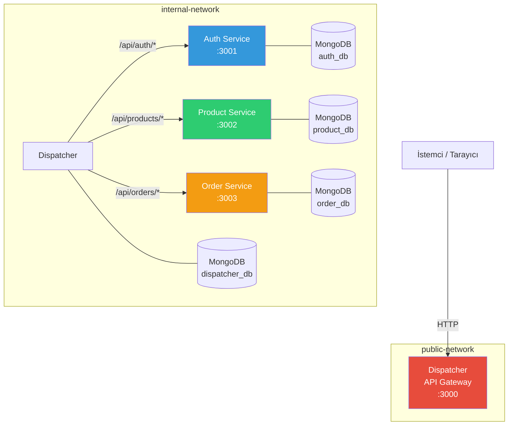
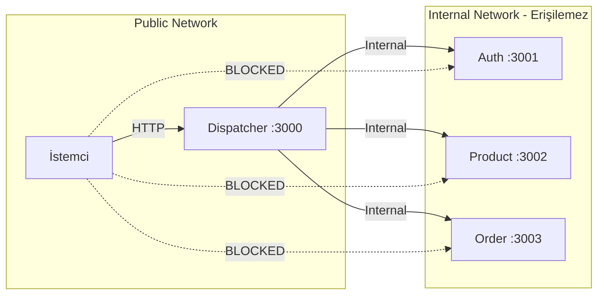
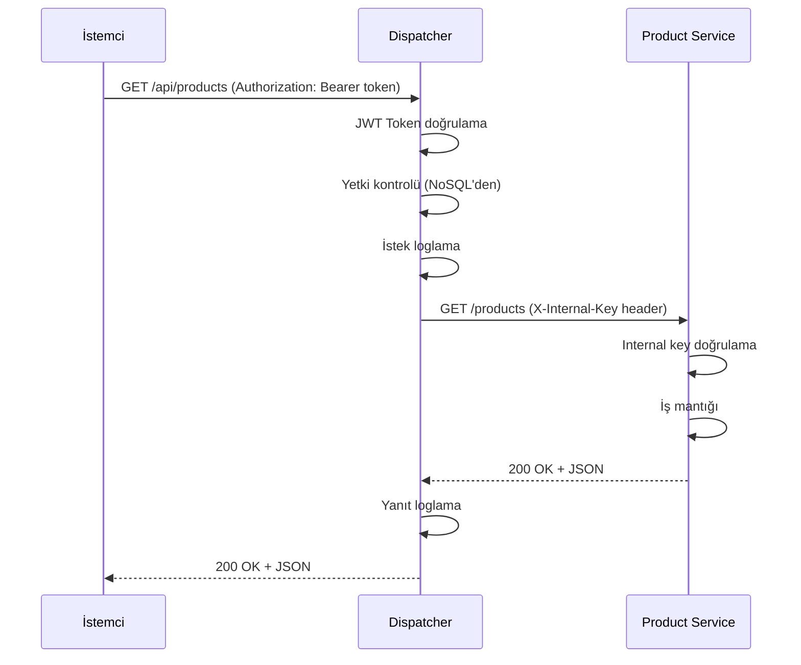
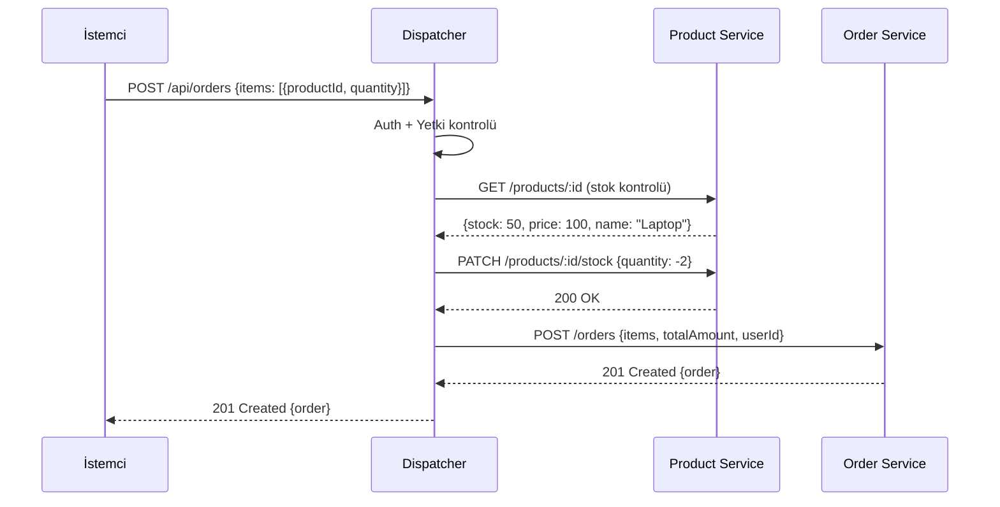
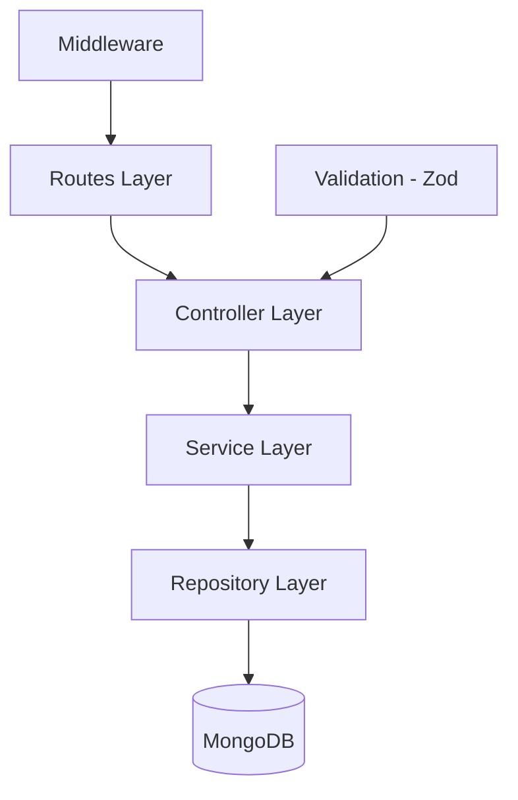

# Sistem Mimarisi — Genel Bakış

**Version:** 1.0.0
**Date:** 2026-03-21
**Status:** Taslak
**Related ADRs:** ADR-001, ADR-002, ADR-003, ADR-004

## Mimari Diyagram

## Network Isolation

- **Dış dünyaya sadece Dispatcher açık** (port 3000)
- Mikroservisler Docker internal network'te
- Mikroservisler `X-Internal-Key` header'ı kontrol eder — sadece Dispatcher'dan gelen istekleri kabul eder
- **Mikroservisler birbirine doğrudan erişmez** — servisler arası koordinasyon Dispatcher orchestration ile yapılır

## İstek Akışı — Basit Proxy

## İstek Akışı — Orchestration (Sipariş Oluşturma)

Birden fazla servisi içeren işlemler Dispatcher tarafından orchestrate edilir:

## Katmanlı Mimari (Her Servis İçin)

| Katman | Sorumluluk |
|--------|------------|
| Routes | HTTP yönlendirme, middleware bağlama |
| Controller | Request/Response işleme, validasyon |
| Service | İş mantığı, business rules |
| Repository | Veritabanı işlemleri (CRUD) |
| Middleware | Auth, logging, error handling |

## İlgili Dokümanlar

- [Tech Stack](tech-stack.md)
- [Servisler](services/INDEX.md)
- [API](api/INDEX.md)
- [Veritabanı](database/INDEX.md)
- [ADR-004: Docker Network Isolation](../adr/adr-004-docker-network-isolation.md)
