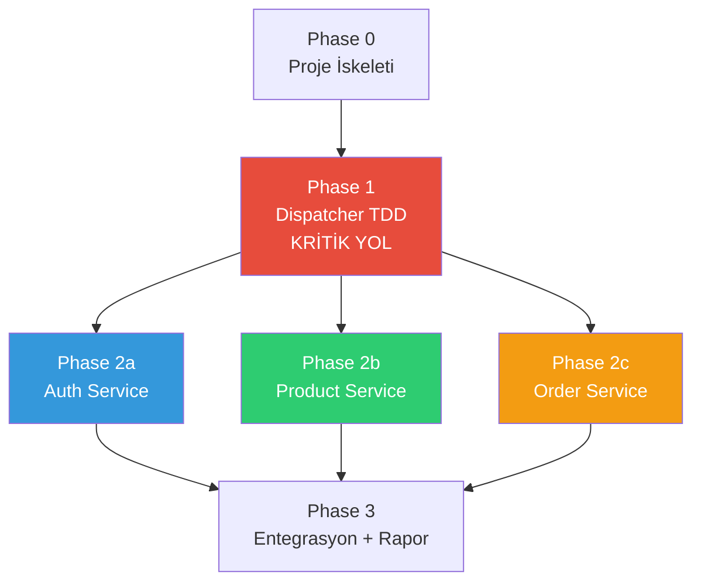
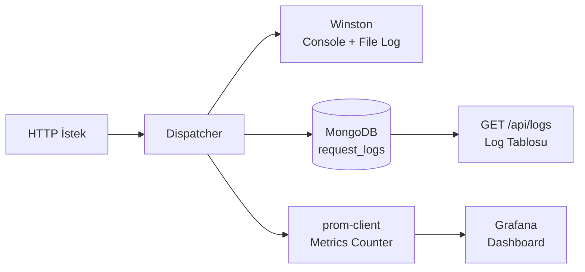

# Transformation Plan — Genel Bakış

**Version:** 1.0.0
**Date:** 2026-03-23
**Status:** Taslak

---

## Mevcut Durum

- Doküman deposu tamamlandı (CLAUDE.md, ADR'ler, rules, skills)
- Mimari kararlar alındı (6 ADR)
- Kod yok, test yok, Docker yok
- 0 / 4 servis implement edildi

## Hedef Durum

- 4 servis çalışır durumda (Dispatcher + Auth + Product + Order)
- `docker-compose up` ile tek komutla ayağa kalkıyor
- Dispatcher TDD ile geliştirilmiş, test coverage >%80
- Diğer servisler test coverage >%60
- Grafana dashboard'ları trafik gösteriyor
- k6 yük testi sonuçları mevcut (50, 100, 200, 500 VU)
- Network isolation kanıtlanmış
- README.md rapor tamamlanmış (Mermaid diyagramları, ekran görüntüleri)
- Sunuma hazır

---

## Faz Bağımlılık Grafi



**Kritik Yol:** Phase 0 → Phase 1 → Phase 2 (paralel) → Phase 3

Phase 2'deki üç servis birbirinden bağımsız — **paralel geliştirilebilir**.

---

## Bileşen-Faz Matrisi

| Bileşen | Phase 0 | Phase 1 | Phase 2a | Phase 2b | Phase 2c | Phase 3 |
|---------|---------|---------|----------|----------|----------|---------|
| docker-compose.yml | OLUŞTUR | — | — | — | — | Güncelle (Grafana, Prometheus) |
| Dispatcher | Scaffold | **FULL (TDD)** | — | — | — | — |
| Auth Service | Scaffold | — | **FULL** | — | — | — |
| Product Service | Scaffold | — | — | **FULL** | — | — |
| Order Service | Scaffold | — | — | — | **FULL** | — |
| Grafana + Prometheus | — | — | — | — | — | **FULL** |
| k6 Yük Testleri | — | — | — | — | — | **FULL** |
| Seed Data | — | — | — | — | — | **FULL** |
| README.md Rapor | — | — | — | — | — | **FULL** |

---

## Fazlar Arası Bağımlılıklar

### Phase 0 → Phase 1'e Ne Sağlar?
- docker-compose.yml (tüm container'lar tanımlı)
- 4 servis scaffold'u (health check çalışır)
- MongoDB bağlantısı (4 database)
- Network isolation (public + internal)
- Shared config (.env, tsconfig)
- InternalAuthMiddleware (mikroservislerde)

### Phase 1 → Phase 2'ye Ne Sağlar?
- Çalışan Dispatcher (routing, proxy, auth + authorization middleware)
- JWT doğrulama mekanizması (authentication)
- route_access_rules ile rol tabanlı yetkilendirme (authorization — DB'den)
- X-Internal-Key header injection
- X-User-Id / X-User-Role header forwarding
- Request/Response loglama
- Error handling (502, 401, 403, 404, 500)
- Rate limiting
- `/api/metrics` endpoint (Prometheus)

### Phase 2 → Phase 3'e Ne Sağlar?
- 3 çalışan mikroservis (Auth, Product, Order)
- Dispatcher orchestration (sipariş oluşturma akışı)
- Tüm endpoint'ler çalışır durumda
- Testler geçiyor

---

## Zaman Planı

**Bugün:** 2026-03-23 | **Teslim:** 2026-04-05 | **Kalan:** 13 gün

| Faz | Tahmini Süre | Tarih Aralığı | Notlar |
|-----|-------------|---------------|--------|
| Phase 0 | 1 gün | 23-24 Mart | Boilerplate + Docker |
| Phase 1 | 3-4 gün | 24-28 Mart | TDD = 3x commit, acele edilmemeli |
| Phase 2 | 3-4 gün | 28 Mart - 1 Nisan | Paralel çalışılabilir |
| Phase 3 | 2-3 gün | 1-4 Nisan | Grafana, k6, rapor |
| Buffer | 1 gün | 4-5 Nisan | Son kontroller, sunum hazırlığı |

> **Uyarı:** Phase 1 en kritik fazdır. TDD disiplini nedeniyle her özellik 3 commit gerektirir.
> Acele edip timestamp hatası yapmak = 0 puan. Zaman baskısı hissedilirse Phase 3'ten
> opsiyonel öğeler (HATEOAS bonus) kırpılır, Phase 1'den asla kırpılmaz.

---

## Risk Kaydı

| ID | Risk | Faz | Olasılık | Etki | Azaltma Stratejisi |
|----|------|-----|----------|------|---------------------|
| R1 | TDD timestamp ihlali (test → impl sırası bozulur) | 1 | Orta | **Kritik (0 puan)** | Her TDD cycle sonunda `git log --oneline` ile sıra kontrolü. `phase-gate` skill'i çalıştır. |
| R2 | Eşit olmayan commit dağılımı | Tümü | Orta | **Kritik (0 puan)** | Her fazın sonunda `git shortlog -sn` ile kontrol. Dengesizlik varsa sonraki fazda telafi. |
| R3 | docker-compose up başarısız | 0 | Düşük | Yüksek | Phase 0 sonunda tam doğrulama. Her fazda `docker-compose up --build` testi. |
| R4 | Orchestration karmaşıklığı (sipariş oluşturma) | 1, 2c | Orta | Yüksek | Orchestration'ı Phase 1'in son adımına bırak. Mock ile test et. |
| R5 | Orchestration rollback (stok düşüldü ama sipariş başarısız) | 1 | Orta | Orta | Basit compensating transaction: hata durumunda stok geri yükle. |
| R6 | Zaman baskısı — Phase 3 yetersiz kalır | 3 | Orta | Orta | HATEOAS bonus (+5) opsiyonel. Öncelik: Grafana + k6 + rapor. |
| R7 | Grafana/Prometheus kurulumu beklenenden uzun sürer | 3 | Orta | Orta | Hazır dashboard template'leri kullan. prom-client iyi dokümante. |
| R8 | Network isolation yanlış yapılandırılır | 0 | Düşük | Yüksek | `docker network inspect` ile doğrula. Dışarıdan erişim testi yap. |
| R9 | MongoDB bağlantı sorunları Docker'da | 0 | Düşük | Yüksek | Resmi mongo:7 image kullan. Connection string'i .env'den al. |

---

## Ekip Çalışma Stratejisi (2 Kişi)

### Temel İlke

Rijit "sen bunu yap, ben bunu yapayım" ataması yerine **esnek iş bölümü**:

- **Phase 0 + Phase 1:** Birlikte veya bir kişi Dispatcher TDD yaparken diğeri Phase 0'ı bitirir ve Phase 2 hazırlığı yapar (model/interface tasarımı, doküman)
- **Phase 2:** 3 bağımsız servis var. Faz başında hangi servisi kimin yapacağına karar verilir. Kim önce bitirirse kalan servisi alır.
- **Phase 3:** Birlikte — entegrasyon, rapor, sunum hazırlığı

### Commit Dengesi Kuralı (Sıfır Tolerans)

PDF'ten: *"Her ekip üyesinden eşit ve düzenli commit beklenmektedir. Bu duruma uymayan gruplara 0 (sıfır) verilecektir."*

- Her faz sonunda `git shortlog -sn` ile commit sayısı kontrol edilmeli
- Dengesizlik varsa sonraki fazda telafi edilmeli
- Commit mesajları açıklayıcı olmalı (sadece sayı değil, kalite de önemli)

### Phase 2 Paralel Çalışma

```
services/
  auth-service/      ← Kişi X
  product-service/   ← Kişi Y
  order-service/     ← Kim önce bitirirse
```

Her servis kendi klasöründe — **git conflict riski sıfır**.

---

## Observability Mimari Açıklaması

Projede üç farklı gözlemlenebilirlik katmanı var. Rolleri karıştırmamak için:

| Katman | Araç | Ne Yapar | Nerede Kullanılır |
|--------|------|----------|-------------------|
| **Loglama** | Winston | Structured JSON log üretir (console + file) | Geliştirme sırasında debug, hata takibi |
| **Log Depolama** | MongoDB (dispatcher_db → request_logs) | Request/response loglarını kalıcı saklar | `GET /api/logs` endpoint'i ile sorgulanır |
| **Metrikler** | Prometheus + prom-client | Sayısal metrikler toplar (request count, duration, error rate) | Grafana dashboard'larında görselleştirilir |



**Winston** her isteği loglar (geliştirici görür), **MongoDB** önemli bilgileri saklar (API ile sorgulanır), **Prometheus** sayısal metrikleri toplar (Grafana gösterir). Üçü birbirini tamamlar.

---

## İlgili Dokümanlar

- [Faz Durumu (INDEX)](INDEX.md)
- [Mimari Genel Bakış](../architecture/overview.md)
- [ADR Kararları](../adr/INDEX.md)
- [Proje Anayasası](../../CLAUDE.md)
