# Phase 1 — Dispatcher (TDD ile)

**Durum:** NOT STARTED
**Tahmini Süre:** 3-4 gün
**Bağımlılık:** Phase 0 tamamlanmış olmalı
**Kritiklik:** EN YÜKSEK — TDD timestamp ihlali = 0 puan

---

## Hedef

Phase 1 bittiğinde:

- Dispatcher tam fonksiyonel API Gateway olarak çalışıyor
- Tüm routing kuralları tanımlı ve test edilmiş
- JWT authentication middleware çalışıyor
- Authorization middleware çalışıyor (route_access_rules DB'den okunuyor)
- Kullanıcı bilgisi (userId, role) mikroservislere iletiliyor
- Request/response logları MongoDB'ye (dispatcher_db) yazılıyor
- Proxy mekanizması istekleri mikroservislere iletiyor
- X-Internal-Key header'ı otomatik ekleniyor
- Hata yönetimi doğru HTTP kodları dönüyor (401, 403, 404, 502, 500)
- Rate limiting aktif
- `/api/metrics` endpoint'i Prometheus formatında metrik dönüyor
- `/api/logs` endpoint'i paginated log tablosu dönüyor (sadece admin)
- Sipariş orchestration çalışıyor (stok kontrol + veri zenginleştirme + sipariş oluşturma + rollback)
- Test coverage >%80
- Tüm testler TDD Red-Green-Refactor ile yazılmış (doğru git timestamp'ları)

---

## TDD Kuralları — Hatırlatma

```
⚠️  SIFIR TOLERANS — Bu kuralların ihlali proje notunu 0 yapar.

1. [RED]      Test dosyasını yaz → jest çalıştır → FAIL etmeli
              └─ git add <test-dosyası> && git commit -m "[TDD-RED] test: ..."

2. [GREEN]    Implementation yaz → jest çalıştır → PASS etmeli
              └─ git add <impl-dosyaları> && git commit -m "[TDD-GREEN] feat: ..."

3. [REFACTOR] Kodu iyileştir → jest çalıştır → PASS etmeli
              └─ git add <değişen-dosyalar> && git commit -m "[TDD-REFACTOR] refactor: ..."

⚠️  git add komutu SPESIFIK dosya isimleri ile yapılmalı (git add -A YASAK).
    Sadece ilgili dosyaları stage'e al.

Kontrol Komutu (HER cycle sonunda — atlamak YASAK):
  git log --oneline --format="%h %ai %s" | head -3
  → RED commit'in timestamp'ı GREEN'den ÖNCE olmalı
```

---

## TDD Cycle'ları (11 Özellik × 3 Commit = 33 Commit)

### Cycle 1: Health Check + App Yapısı

**RED — Test:**
```typescript
// __tests__/health.test.ts
describe('Health Check', () => {
  it('should return 200 with service status', async () => {
    const response = await request(app).get('/health');
    expect(response.status).toBe(200);
    expect(response.body.success).toBe(true);
    expect(response.body.data.service).toBe('dispatcher');
    expect(response.body.data.status).toBe('ok');
  });
});
```

**GREEN — Implementation:**
- Express app factory (`createApp`)
- HealthController, HealthRoutes
- Config modülü (env variables)

**REFACTOR:**
- Interface'leri çıkar (IHealthResponse)
- App yapısını düzenle

---

### Cycle 2: Service Registry + Router

**RED — Test:**
```typescript
// __tests__/router.test.ts
describe('Service Registry', () => {
  it('should map /api/auth/* to auth-service:3001', ...);
  it('should map /api/products/* to product-service:3002', ...);
  it('should map /api/categories/* to product-service:3002', ...);
  it('should map /api/orders/* to order-service:3003', ...);
  it('should return 404 for unknown routes', ...);
});
```

**GREEN — Implementation:**
- IServiceConfig interface
- ServiceRegistry class (servis → URL mapping)
- RouterService class (route matching)

**REFACTOR:**
- Config'den servis URL'lerini al (hardcoded olmasın)
- Route pattern matching iyileştir

---

### Cycle 3: Proxy Middleware (İstek Yönlendirme)

**RED — Test:**
```typescript
// __tests__/proxy.test.ts
describe('Proxy Middleware', () => {
  it('should forward GET request to target service', ...);
  it('should forward POST request with body', ...);
  it('should inject X-Internal-Key header', ...);
  it('should forward X-User-Id and X-User-Role headers', ...);
  it('should return 502 when target service unreachable', ...);
  it('should preserve original query parameters', ...);
});
```

**GREEN — Implementation:**
- IProxyService interface
- ProxyService class (axios ile HTTP forwarding)
- X-Internal-Key header injection
- X-User-Id / X-User-Role header forwarding (auth sonrası)

**REFACTOR:**
- Timeout konfigürasyonu
- Error handling iyileştir (connection refused vs timeout)

> **Not:** Bu aşamada mikroservisler sadece health check döner. Proxy testleri HTTP
> çağrılarını mock'layarak çalışır (jest.mock axios/fetch).

---

### Cycle 4: JWT Authentication Middleware

**RED — Test:**
```typescript
// __tests__/auth-middleware.test.ts
describe('Auth Middleware', () => {
  describe('korumalı rotalar', () => {
    it('should return 401 when no token provided', ...);
    it('should return 401 when token is invalid', ...);
    it('should return 401 when token is expired', ...);
    it('should pass through with valid token', ...);
    it('should attach userId and role to request', ...);
  });

  describe('public rotalar', () => {
    it('should skip auth for POST /api/auth/register', ...);
    it('should skip auth for POST /api/auth/login', ...);
    it('should skip auth for GET /health', ...);
  });
});
```

**GREEN — Implementation:**
- IAuthMiddleware interface
- AuthMiddleware class
  - JWT doğrulama (jsonwebtoken)
  - Public route listesi (auth gerekmeyenler)
  - Token'dan userId ve role çıkarma
  - Request nesnesine userId ve role ekleme

**REFACTOR:**
- Public route config'ini dışarı çıkar
- Error mesajlarını standartlaştır

---

### Cycle 5: Authorization Middleware (Yetkilendirme)

> **Mimari Not:** PDF gereksinimleri "Yetkilendirme bilgisi NoSQL'de tutulmalı" der.
> Bu, route erişim kurallarının MongoDB'de (dispatcher_db → route_access_rules) saklanması
> anlamına gelir. Yetkilendirme kararı **sadece Dispatcher'da** yapılır — mikroservisler
> yetkilendirme yapmaz, sadece veri filtreler (data scoping).

**RED — Test:**
```typescript
// __tests__/authorization.test.ts
describe('Authorization Middleware', () => {
  describe('public rotalar', () => {
    it('should allow access to public routes without token', ...);
  });

  describe('protected rotalar', () => {
    it('should allow authenticated user access to protected routes', ...);
    it('should return 403 when unauthenticated user accesses protected route', ...);
  });

  describe('admin rotalar', () => {
    it('should allow admin access to admin routes', ...);
    it('should return 403 when non-admin accesses admin route', ...);
    it('should return 403 with standard error format', ...);
  });

  describe('route rules', () => {
    it('should load route access rules from database', ...);
    it('should deny access when no matching rule found (default deny)', ...);
  });
});
```

**GREEN — Implementation:**
- IRouteAccessRule interface
- RouteAccessRule Mongoose model (dispatcher_db → route_access_rules collection)
- IAuthorizationMiddleware interface
- AuthorizationMiddleware class
  - DB'den route_access_rules okur
  - İstek path + method ile kuralı eşleştirir
  - authLevel kontrolü: public (herkes), protected (JWT gerekli), admin (admin rolü gerekli)
  - Eşleşen kural yoksa → default deny (403)
- Seed data: Tüm proxy routing tablosundaki route kuralları

**REFACTOR:**
- Route kurallarını cache'e al (her istekte DB sorgusu yerine startup'ta yükle)
- Pattern matching optimizasyonu (parametreli route'lar: `/api/products/:id`)

**Route Access Rules Seed Data (dispatcher_db → route_access_rules):**

| Path Pattern | Method | Auth Level |
|-------------|--------|------------|
| /api/auth/register | POST | public |
| /api/auth/login | POST | public |
| /api/auth/profile | GET | protected |
| /api/products | GET | protected |
| /api/products/:id | GET | protected |
| /api/products | POST | admin |
| /api/products/:id | PUT | admin |
| /api/products/:id | DELETE | admin |
| /api/categories | GET | protected |
| /api/categories/:id | GET | protected |
| /api/categories | POST | admin |
| /api/categories/:id | PUT | admin |
| /api/categories/:id | DELETE | admin |
| /api/orders | POST | protected |
| /api/orders | GET | protected |
| /api/orders/:id | GET | protected |
| /api/orders/:id/status | PATCH | protected |
| /api/logs | GET | admin |
| /api/metrics | GET | public |
| /health | GET | public |

---

### Cycle 6: Request/Response Loglama

**RED — Test:**
```typescript
// __tests__/logging.test.ts
describe('Request Logging', () => {
  it('should log request with method, path, timestamp', ...);
  it('should log response with statusCode and responseTime', ...);
  it('should include userId from JWT (if authenticated)', ...);
  it('should include targetService name', ...);
  it('should log error message on failure', ...);
  it('should not block response while logging (async)', ...);
});
```

**GREEN — Implementation:**
- IRequestLog interface
- RequestLog Mongoose model (dispatcher_db → request_logs collection)
- ILogRepository interface
- LogRepository class (MongoDB CRUD)
- ILogService interface
- LogService class (log oluşturma, async write)
- LoggingMiddleware class (Express middleware)
- Winston logger entegrasyonu (console + file transport)

**REFACTOR:**
- Fire-and-forget async loglama (yanıtı bekletme)
- Winston format config

---

### Cycle 7: Error Handler Middleware

**RED — Test:**
```typescript
// __tests__/error-handler.test.ts
describe('Error Handler', () => {
  it('should return 400 for validation errors', ...);
  it('should return 401 for authentication errors', ...);
  it('should return 403 for authorization errors', ...);
  it('should return 404 for not found errors', ...);
  it('should return 502 for proxy/gateway errors', ...);
  it('should return 500 for unknown errors', ...);
  it('should return standard error format', ...);
  // { success: false, error: { code: "...", message: "..." } }
  it('should not leak stack traces in production', ...);
});
```

**GREEN — Implementation:**
- AppError base class (code, statusCode, message)
- Error alt sınıfları: ValidationError, AuthenticationError, AuthorizationError, NotFoundError, ProxyError
- ErrorHandlerMiddleware class (Express error middleware)
- Hata → HTTP status code mapping

**REFACTOR:**
- Error sınıf hiyerarşisini düzenle
- Stack trace filtering

---

### Cycle 8: Rate Limiting

**RED — Test:**
```typescript
// __tests__/rate-limit.test.ts
describe('Rate Limiting', () => {
  it('should allow requests within limit', ...);
  it('should return 429 when limit exceeded', ...);
  it('should reset after window expires', ...);
  it('should return Retry-After header', ...);
});
```

**GREEN — Implementation:**
- IRateLimitMiddleware interface
- RateLimitMiddleware class (express-rate-limit veya custom)
- Konfigürasyon: windowMs, max (env'den)

**REFACTOR:**
- Rate limit config'ini env'den al
- Per-route limit desteği

---

### Cycle 9: Prometheus Metrics

**RED — Test:**
```typescript
// __tests__/metrics.test.ts
describe('Prometheus Metrics', () => {
  it('should return metrics at GET /api/metrics', ...);
  it('should return Prometheus text format (content-type)', ...);
  it('should track http_requests_total counter', ...);
  it('should track http_request_duration_seconds histogram', ...);
  it('should track http_requests_by_service counter', ...);
  it('should track http_errors_total counter', ...);
  it('should track active_connections gauge', ...);
});
```

> **Not:** Tüm 5 metrik ADR-006'da tanımlıdır. Her biri için test yazılmalıdır.

**GREEN — Implementation:**
- IMetricsMiddleware interface
- MetricsMiddleware class (prom-client)
- 5 Metrik (ADR-006 uyumlu):
  - `http_requests_total` (Counter) — label: method, path, status
  - `http_request_duration_seconds` (Histogram) — label: method, path
  - `http_requests_by_service` (Counter) — label: service
  - `http_errors_total` (Counter) — label: method, path, status
  - `active_connections` (Gauge)
- MetricsController: GET /api/metrics

**REFACTOR:**
- Metrik label'larını düzenle
- Default metrik config

> **Erişim Notu:** `/api/metrics` endpoint'i `public` olarak tanımlıdır çünkü Prometheus
> (internal-network'te) bu endpoint'i auth olmadan scrape etmelidir. Üretim ortamında
> bu endpoint IP whitelist veya ayrı port ile korunmalıdır.

---

### Cycle 10: Log Tablosu Endpoint

**RED — Test:**
```typescript
// __tests__/logs-endpoint.test.ts
describe('GET /api/logs', () => {
  it('should return paginated log entries', ...);
  it('should filter by date range', ...);
  it('should filter by target service', ...);
  it('should filter by status code', ...);
  it('should return standard pagination meta', ...);
  it('should require admin role (return 403 for non-admin)', ...);
  it('should return 401 when no token provided', ...);
});
```

**GREEN — Implementation:**
- LogController class (GET /api/logs)
- Query parametreleri: page, limit, startDate, endDate, service, statusCode
- Pagination response format (meta: { page, limit, total, totalPages })

**REFACTOR:**
- Query builder pattern
- Default sort (newest first)

> **Not:** `/api/logs` admin-only erişimlidir. Bu kural route_access_rules tablosunda
> `authLevel: "admin"` olarak tanımlıdır (Cycle 5'teki seed data'da mevcut).

---

### Cycle 11: Sipariş Orchestration

**RED — Test:**
```typescript
// __tests__/order-orchestration.test.ts
describe('Order Orchestration', () => {
  describe('başarılı akış', () => {
    it('should check product stock via Product Service', ...);
    it('should extract product data for enrichment (name, price)', ...);
    it('should deduct stock via Product Service', ...);
    it('should create order with enriched data via Order Service', ...);
    it('should return 201 with created order', ...);
  });

  describe('hata senaryoları', () => {
    it('should return 404 when product not found', ...);
    it('should return 400 when insufficient stock', ...);
    it('should rollback stock when order creation fails', ...);
    it('should return 502 when Product Service unreachable', ...);
    it('should return 502 when Order Service unreachable', ...);
  });
});
```

**GREEN — Implementation:**
- IOrderOrchestrationService interface
- OrderOrchestrationService class:
  1. **Stok kontrol + veri toplama:** GET → Product Service → `{stock, price, name}`
  2. **Stok düşme:** PATCH → Product Service → `{quantity: -N}`
  3. **Veri zenginleştirme:** Dispatcher, Product Service'ten aldığı `name` ve `price` bilgilerini
     Order Service'e göndereceği payload'a ekler (snapshot prensibi)
  4. **Sipariş oluşturma:** POST → Order Service → `{items, totalAmount, userId}`
  5. **Rollback:** Stok geri yükleme (hata durumunda)
- OrderOrchestrationController
- Route: POST /api/orders → orchestration

**REFACTOR:**
- Compensating transaction pattern düzenle
- Error mesajlarını detaylandır

**Orchestration Akışı (Detaylı):**
```
İstemci → POST /api/orders { items: [{ productId, quantity }], shippingAddress?: {...} }

Dispatcher orchestration:
  1. Stok kontrol + veri toplama (tüm item'lar için):
     Her item için:
       a. GET /products/:id → Product Service
          → Yanıt: { name, price, stock, ... }
          → Stok kontrol: stock >= quantity? (değilse → 400, hemen dur)
          → Veri sakla: productName = name, unitPrice = price

  2. Stok düşme (tüm item'lar için — kısmi hata rollback'li):
     Her item için sırayla:
       b. PATCH /products/:id/stock { quantity: -N } → Product Service
          → BAŞARISIZ? → Daha önce düşülmüş item'ların stoğunu geri yükle
             (compensating: PATCH { quantity: +N } her başarılı item için)
             → 502 dön ve dur

  3. Veri zenginleştir ve sipariş oluştur:
     c. POST /orders → Order Service
        {
          userId: JWT'den,
          items: [{
            productId,
            productName,   ← GET yanıtından (snapshot)
            quantity,
            unitPrice,     ← GET yanıtından (snapshot)
            totalPrice     ← quantity × unitPrice (Dispatcher hesaplar)
          }],
          totalAmount,     ← tüm item'ların totalPrice toplamı
          shippingAddress   ← istemci request'inden (opsiyonel, varsa ilet)
        }

  4. Sipariş oluşturma başarısız? (3c hata verirse):
     d. TÜM item'lar için PATCH /products/:id/stock { quantity: +N } → rollback
```

**Rollback Özet Tablosu:**

| Hata Noktası | Rollback Aksiyonu |
|-------------|-------------------|
| Adım 1 (stok kontrol) başarısız | Rollback yok (henüz değişiklik yapılmadı) |
| Adım 2 (stok düşme) kısmen başarısız | Daha önce düşülmüş item'ların stoğunu geri yükle |
| Adım 3 (sipariş oluşturma) başarısız | TÜM item'ların stoğunu geri yükle |

> **Snapshot prensibi:** Ürün adı ve fiyatı sipariş anında sabitlenir.
> Dispatcher, Product Service GET yanıtından bu verileri alır ve Order Service'e
> gönderir. Ürün fiyatı sonradan değişse bile sipariş kaydı etkilenmez.

> **shippingAddress:** İstemci request body'sinde opsiyonel olarak gönderebilir.
> Dispatcher bu alanı olduğu gibi Order Service'e iletir (pass-through).

---

## Sıralama ve Paralelleştirme

```
Cycle 1 → 2 → 3 → 4 → 5 → 6 → 7: SIRAYLA (her biri bir öncekine bağımlı)
Cycle 8 (Rate Limit): 7'den sonra, bağımsız
Cycle 9 (Metrics): 7'den sonra, bağımsız
Cycle 10 (Logs): 6 ve 7'den sonra
Cycle 11 (Orchestration): En sona (Product ve Order Service API tasarımını bilmek gerekir)
```

**Önerilen sıra:** 1 → 2 → 3 → 4 → 5 → 6 → 7 → 8 → 9 → 10 → 11

Orchestration en sona bırakılır çünkü Product ve Order Service API'lerinin tasarımını bilmeyi gerektirir.

---

## Veritabanı Modeli

**Database:** `dispatcher_db`

**Collection: `request_logs`**

| Alan | Tip | Zorunlu | Açıklama |
|------|-----|---------|----------|
| _id | ObjectId | Auto | |
| timestamp | Date | Evet | İstek zamanı |
| method | String | Evet | HTTP metodu (GET, POST, vb.) |
| path | String | Evet | İstek yolu (/api/products) |
| statusCode | Number | Evet | HTTP durum kodu |
| responseTime | Number | Evet | Yanıt süresi (ms) |
| userId | String | Hayır | JWT'den (null = anonim) |
| targetService | String | Hayır | auth, product, order |
| requestBody | Object | Hayır | İstek gövdesi (hassas veri filtrelenir) |
| error | String | Hayır | Hata mesajı (varsa) |
| ip | String | Hayır | İstemci IP adresi |

**Index'ler:**
- `{ timestamp: -1 }` — Yeni loglar önce
- `{ targetService: 1, timestamp: -1 }` — Servise göre filtreleme

**Collection: `route_access_rules`**

| Alan | Tip | Zorunlu | Açıklama |
|------|-----|---------|----------|
| _id | ObjectId | Auto | |
| path | String | Evet | Route pattern (/api/products/:id) |
| method | String | Evet | HTTP metodu (GET, POST, PUT, DELETE, PATCH) |
| authLevel | String | Evet | enum: public, protected, admin |
| description | String | Hayır | Açıklama (ör: "Ürün oluşturma") |

**Index'ler:**
- `{ path: 1, method: 1 }` — Unique compound index (route eşleştirme)

> **Not:** route_access_rules verisi Dispatcher başlatılırken seed edilir.
> PDF gereksinimi: "Yetkilendirme bilgisi NoSQL'de tutulmalı" — bu koleksiyon
> bu gereksinimi karşılar.

---

## API Endpoint'leri (Dispatcher Kendisi)

| Metot | Yol | Açıklama | Auth | Durum Kodu |
|-------|-----|----------|------|------------|
| GET | /health | Sağlık kontrolü | Public | 200 |
| GET | /api/metrics | Prometheus metrikleri | Public | 200 |
| GET | /api/logs | Log tablosu (paginated) | Admin | 200 |

## Proxy Routing Tablosu (Dispatcher → Mikroservis)

| Dış URL (İstemci) | Metot | İç URL (Mikroservis) | Auth Level |
|-------------------|-------|---------------------|------------|
| /api/auth/register | POST | auth-service:3001/auth/register | Public |
| /api/auth/login | POST | auth-service:3001/auth/login | Public |
| /api/auth/profile | GET | auth-service:3001/auth/profile | Protected |
| /api/products | GET | product-service:3002/products | Protected |
| /api/products/:id | GET | product-service:3002/products/:id | Protected |
| /api/products | POST | product-service:3002/products | Admin |
| /api/products/:id | PUT | product-service:3002/products/:id | Admin |
| /api/products/:id | DELETE | product-service:3002/products/:id | Admin |
| /api/products/:id/stock | PATCH | product-service:3002/products/:id/stock | **Internal-Only** |
| /api/categories | GET | product-service:3002/categories | Protected |
| /api/categories/:id | GET | product-service:3002/categories/:id | Protected |
| /api/categories | POST | product-service:3002/categories | Admin |
| /api/categories/:id | PUT | product-service:3002/categories/:id | Admin |
| /api/categories/:id | DELETE | product-service:3002/categories/:id | Admin |
| /api/orders | POST | **ORCHESTRATED** (Dispatcher kendisi) | Protected |
| /api/orders | GET | order-service:3003/orders | Protected |
| /api/orders/:id | GET | order-service:3003/orders/:id | Protected |
| /api/orders/:id/status | PATCH | order-service:3003/orders/:id/status | Protected |

> **Internal-Only:** `/api/products/:id/stock` endpoint'i dış istemcilerden gelen isteklere
> proxy yapılmaz. Sadece Dispatcher'ın orchestration servisi tarafından dahili olarak çağrılır.

> **PATCH /orders/:id/status — Protected (Admin değil):** Bu endpoint hem admin hem de
> sipariş sahibi tarafından kullanılabilir. Admin herhangi bir geçerli status geçişi yapabilir,
> sipariş sahibi ise sadece pending → cancelled geçişi yapabilir. Bu mantık (data scoping)
> Order Service tarafında uygulanır — Dispatcher sadece authentication doğrular.

**Header Injection (her proxy isteğinde):**
```
X-Internal-Key: {INTERNAL_KEY}
X-User-Id: {JWT'den çıkarılan userId}
X-User-Role: {JWT'den çıkarılan role}
```

---

## Sınıf Diyagramı

```mermaid
classDiagram
    class App {
        -express: Express
        +createApp(): Express
    }

    class ServiceRegistry {
        -services: Map~string, IServiceConfig~
        +getService(path: string): IServiceConfig
        +registerService(config: IServiceConfig): void
    }

    class ProxyService {
        -serviceRegistry: IServiceRegistry
        +forward(req: Request, serviceConfig: IServiceConfig): Promise~ProxyResponse~
    }

    class AuthMiddleware {
        -jwtSecret: string
        -publicRoutes: string[]
        +authenticate(req, res, next): void
    }

    class AuthorizationMiddleware {
        -routeAccessRules: IRouteAccessRule[]
        +authorize(req, res, next): void
        -matchRule(path: string, method: string): IRouteAccessRule | null
        -loadRules(): Promise~void~
    }

    class IRouteAccessRule {
        <<interface>>
        +path: string
        +method: string
        +authLevel: string
        +description?: string
    }

    class LogService {
        -logRepository: ILogRepository
        -logger: Winston
        +logRequest(entry: IRequestLog): Promise~void~
        +getLogs(query: ILogQuery): Promise~PaginatedResult~
    }

    class LogRepository {
        -model: Model~RequestLog~
        +create(log: IRequestLog): Promise~RequestLog~
        +find(query, pagination): Promise~RequestLog[]~
        +count(query): Promise~number~
    }

    class ErrorHandlerMiddleware {
        +handle(err, req, res, next): void
    }

    class RateLimitMiddleware {
        -windowMs: number
        -max: number
        +limit(req, res, next): void
    }

    class MetricsMiddleware {
        -requestCounter: Counter
        -requestDuration: Histogram
        -requestsByService: Counter
        -errorsTotal: Counter
        -activeConnections: Gauge
        +collect(req, res, next): void
        +getMetrics(req, res): void
    }

    class OrderOrchestrationService {
        -proxyService: IProxyService
        +createOrder(orderData, userId): Promise~Order~
        -checkStock(productId, quantity): Promise~Product~
        -deductStock(productId, quantity): Promise~void~
        -rollbackStock(productId, quantity): Promise~void~
        -enrichOrderData(items, products): OrderPayload
    }

    class AppError {
        +code: string
        +statusCode: number
        +message: string
    }

    App --> ServiceRegistry
    App --> ProxyService
    App --> AuthMiddleware
    App --> AuthorizationMiddleware
    App --> LogService
    App --> ErrorHandlerMiddleware
    App --> RateLimitMiddleware
    App --> MetricsMiddleware
    ProxyService --> ServiceRegistry
    LogService --> LogRepository
    OrderOrchestrationService --> ProxyService
    ErrorHandlerMiddleware --> AppError
    AuthorizationMiddleware --> IRouteAccessRule
```



---

## Test Dosyaları

| # | Dosya | TDD Cycle |
|---|-------|-----------|
| 1 | `__tests__/health.test.ts` | Cycle 1 |
| 2 | `__tests__/router.test.ts` | Cycle 2 |
| 3 | `__tests__/proxy.test.ts` | Cycle 3 |
| 4 | `__tests__/auth-middleware.test.ts` | Cycle 4 |
| 5 | `__tests__/authorization.test.ts` | Cycle 5 |
| 6 | `__tests__/logging.test.ts` | Cycle 6 |
| 7 | `__tests__/error-handler.test.ts` | Cycle 7 |
| 8 | `__tests__/rate-limit.test.ts` | Cycle 8 |
| 9 | `__tests__/metrics.test.ts` | Cycle 9 |
| 10 | `__tests__/logs-endpoint.test.ts` | Cycle 10 |
| 11 | `__tests__/order-orchestration.test.ts` | Cycle 11 |

---

## Commit Listesi (33 Commit)

| # | Mesaj | Tip |
|---|-------|-----|
| 1 | `[TDD-RED] test: dispatcher health check testi` | RED |
| 2 | `[TDD-GREEN] feat: dispatcher health check endpoint` | GREEN |
| 3 | `[TDD-REFACTOR] refactor: health check interface ve yapı` | REFACTOR |
| 4 | `[TDD-RED] test: service registry ve router testleri` | RED |
| 5 | `[TDD-GREEN] feat: service registry ve router implementasyonu` | GREEN |
| 6 | `[TDD-REFACTOR] refactor: service registry config iyileştirmesi` | REFACTOR |
| 7 | `[TDD-RED] test: proxy middleware testleri` | RED |
| 8 | `[TDD-GREEN] feat: proxy middleware implementasyonu` | GREEN |
| 9 | `[TDD-REFACTOR] refactor: proxy error handling iyileştirmesi` | REFACTOR |
| 10 | `[TDD-RED] test: JWT auth middleware testleri` | RED |
| 11 | `[TDD-GREEN] feat: JWT auth middleware implementasyonu` | GREEN |
| 12 | `[TDD-REFACTOR] refactor: auth middleware config ve yapı` | REFACTOR |
| 13 | `[TDD-RED] test: authorization middleware testleri` | RED |
| 14 | `[TDD-GREEN] feat: authorization middleware ve route_access_rules` | GREEN |
| 15 | `[TDD-REFACTOR] refactor: authorization rule caching` | REFACTOR |
| 16 | `[TDD-RED] test: request/response loglama testleri` | RED |
| 17 | `[TDD-GREEN] feat: loglama middleware ve repository` | GREEN |
| 18 | `[TDD-REFACTOR] refactor: async loglama ve Winston entegrasyonu` | REFACTOR |
| 19 | `[TDD-RED] test: error handler middleware testleri` | RED |
| 20 | `[TDD-GREEN] feat: centralized error handler` | GREEN |
| 21 | `[TDD-REFACTOR] refactor: error sınıf hiyerarşisi` | REFACTOR |
| 22 | `[TDD-RED] test: rate limiting testleri` | RED |
| 23 | `[TDD-GREEN] feat: rate limiting middleware` | GREEN |
| 24 | `[TDD-REFACTOR] refactor: rate limit config iyileştirmesi` | REFACTOR |
| 25 | `[TDD-RED] test: Prometheus metrics testleri` | RED |
| 26 | `[TDD-GREEN] feat: Prometheus metrics endpoint` | GREEN |
| 27 | `[TDD-REFACTOR] refactor: metrik label ve config düzeni` | REFACTOR |
| 28 | `[TDD-RED] test: log tablosu endpoint testleri` | RED |
| 29 | `[TDD-GREEN] feat: GET /api/logs endpoint` | GREEN |
| 30 | `[TDD-REFACTOR] refactor: log query builder pattern` | REFACTOR |
| 31 | `[TDD-RED] test: sipariş orchestration testleri` | RED |
| 32 | `[TDD-GREEN] feat: sipariş orchestration ve rollback` | GREEN |
| 33 | `[TDD-REFACTOR] refactor: orchestration error handling` | REFACTOR |

---

## Quality Gate — Phase 2'ye Geçmeden Önce

### Fonksiyonellik
- [ ] Tüm testler geçiyor (`jest --coverage`)
- [ ] Coverage >%80
- [ ] Her test dosyasının git timestamp'ı ilgili implementation'dan ÖNCE
- [ ] `docker-compose up` ile Dispatcher çalışıyor
- [ ] Health check çalışıyor (GET /health → 200)

### Authentication & Authorization
- [ ] JWT doğrulama çalışıyor (geçersiz token → 401)
- [ ] Public route'lar auth'suz erişilebilir (register, login)
- [ ] Protected route'lar geçerli JWT gerektirir
- [ ] Admin route'lar admin rolü gerektirir (non-admin → 403)
- [ ] route_access_rules dispatcher_db'de tanımlı ve seed edilmiş
- [ ] `/api/logs` sadece admin erişimli (non-admin → 403)

### Proxy & Communication
- [ ] Proxy mekanizması çalışıyor (stub servislere istek iletiyor)
- [ ] X-Internal-Key header ekleniyor (proxy isteklerinde)
- [ ] X-User-Id ve X-User-Role header'ları iletiliyor

### Logging & Monitoring
- [ ] Loglama MongoDB'ye yazıyor (dispatcher_db → request_logs)
- [ ] Winston console log çalışıyor
- [ ] `/api/metrics` Prometheus formatı dönüyor (5 metrik: ADR-006)
- [ ] `/api/logs` paginated log dönüyor

### Error Handling & Security
- [ ] Rate limiting çalışıyor (aşım → 429)
- [ ] Error handler doğru HTTP kodları dönüyor (400, 401, 403, 404, 500, 502)
- [ ] Error response formatı standart: `{ success: false, error: { code, message } }`

### Orchestration
- [ ] Orchestration mock ile çalışıyor
- [ ] Veri zenginleştirme doğru (productName, unitPrice snapshot)
- [ ] Rollback stratejisi test edilmiş

### Kod Kalitesi
- [ ] TypeScript build hatasız (`tsc --noEmit`)
- [ ] TODO/FIXME/HACK yok
- [ ] Dead code yok
- [ ] `any` type yok
- [ ] Dokümanlar güncel (route-map, servis dokümanı)

---

## İlgili Dokümanlar

- [ADR-005: Jest + TDD](../adr/adr-005-jest-tdd.md)
- [ADR-003: Express.js](../adr/adr-003-express-gateway.md)
- [ADR-006: Grafana + Prometheus](../adr/adr-006-grafana-monitoring.md)
- [Testing Rules](../../.claude/rules/testing.md)
- [API Conventions](../../.claude/rules/api-conventions.md)
- [create-test-first Skill](../../.claude/skills/create-test-first.md)
