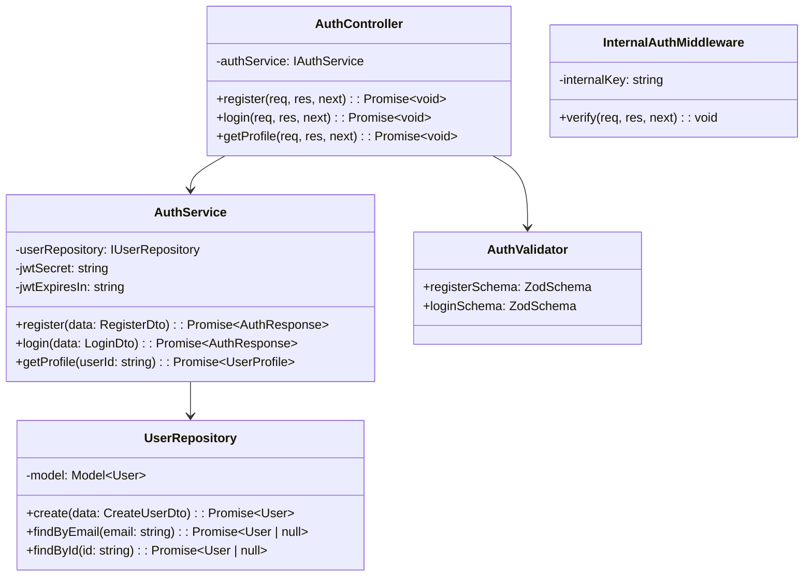

# Phase 2a — Auth Service

**Durum:** NOT STARTED
**Tahmini Süre:** 1-1.5 gün
**Bağımlılık:** Phase 1 tamamlanmış olmalı (Dispatcher routing + auth middleware hazır)

---

## Hedef

Phase 2a bittiğinde:

- Kullanıcı kaydı (register) çalışıyor
- Kullanıcı girişi (login) çalışıyor, JWT access token dönüyor
- Kullanıcı profili (profile) çalışıyor
- Şifreler bcrypt ile hash'leniyor
- Kullanıcı rolleri (admin, customer) destekleniyor
- Zod validasyon tüm input'larda aktif
- InternalAuthMiddleware dış istekleri engelliyor
- Dispatcher üzerinden proxy çalışıyor
- Test coverage >%60

---

## Ön Koşullar

- Phase 0: Servis scaffold'u hazır, docker-compose çalışıyor
- Phase 1: Dispatcher routing `/api/auth/*` → auth-service:3001 tanımlı

---

## Adımlar

### Adım 2a.1: User Model + Repository

**Dosyalar:**
```
services/auth-service/src/interfaces/user.interface.ts
services/auth-service/src/models/user.model.ts
services/auth-service/src/interfaces/user-repository.interface.ts
services/auth-service/src/repositories/user.repository.ts
```

- IUser interface (TypeScript tip tanımı)
- User Mongoose schema + model
- IUserRepository interface (findByEmail, findById, create)
- UserRepository class (MongoDB CRUD)

### Adım 2a.2: Auth Service

**Dosyalar:**
```
services/auth-service/src/interfaces/auth-service.interface.ts
services/auth-service/src/services/auth.service.ts
```

- IAuthService interface (register, login, getProfile)
- AuthService class:
  - **register:** Email tekrarı kontrolü → şifreyi bcrypt ile hash'le → kullanıcı oluştur → JWT üret → dön
  - **login:** Email ile kullanıcı bul → bcrypt.compare ile şifre doğrula → JWT üret → dön
  - **getProfile:** userId ile kullanıcı bul → şifre hariç dön

**JWT Payload:**
```json
{
  "userId": "64a...",
  "role": "customer",
  "iat": 1234567890,
  "exp": 1234654290
}
```

> **Not:** Sadece access token. Refresh token gereksiz karmaşıklık — proje isterlerinde zorunlu değil.

### Mimari Karar: Auth Mantığı Nerede?

PDF: *"Yetkilendirme mantığı SADECE Dispatcher'da olmalıdır."*

**Yorumumuz:** Auth Service **kimlik doğrulama verisi yönetir** (kullanıcı kaydı, şifre hash, JWT üretimi). Dispatcher **yetkilendirme kararını verir** (JWT doğrulama, rol kontrolü, erişim izni). Bu ayrım:

| Sorumluluk | Nerede |
|-----------|--------|
| Kullanıcı kaydı (register) | Auth Service |
| Şifre doğrulama (login) | Auth Service |
| JWT üretimi (token signing) | Auth Service |
| JWT doğrulama (token verification) | **Dispatcher** |
| Rol kontrolü (authorization) | **Dispatcher** |
| Erişim kuralları (route access rules) | **Dispatcher (dispatcher_db)** |

Auth Service bir "credential store + token factory"dir. Yetkilendirme kararı (bu kullanıcı bu endpoint'e erişebilir mi?) **sadece Dispatcher'da** yapılır. Bu yorum PDF gereksinimini karşılar çünkü hiçbir mikroservis yetkilendirme kararı almaz.

> **JWT_SECRET paylaşımı:** Auth Service JWT imzalar, Dispatcher JWT doğrular. Her ikisi de aynı `JWT_SECRET` env variable'ı kullanır. Bu, JWT'nin bütünlüğünü sağlar.

### Adım 2a.3: Controller + Validators

**Dosyalar:**
```
services/auth-service/src/interfaces/auth-controller.interface.ts
services/auth-service/src/controllers/auth.controller.ts
services/auth-service/src/validators/auth.validator.ts
```

- AuthController class (request/response handling, validasyon çağırma)
- Zod şemaları:

**registerSchema:**
```typescript
{
  email: z.string().email(),
  password: z.string().min(6),
  name: z.string().min(2)
  // role YOKTUR — public register her zaman customer oluşturur.
  // Admin hesapları sadece seed data ile oluşturulur.
  // Bu, herkesin kendini admin yapmasını engeller.
}
```

**loginSchema:**
```typescript
{
  email: z.string().email(),
  password: z.string().min(1)
}
```

### Adım 2a.4: Routes

**Dosyalar:**
```
services/auth-service/src/routes/auth.routes.ts
```

Route tanımları (iç URL'ler — Dispatcher'dan proxy ile gelir):

| Metot | İç Yol | Dış Yol (Dispatcher) | Durum Kodu |
|-------|--------|---------------------|------------|
| POST | /auth/register | /api/auth/register | 201 Created |
| POST | /auth/login | /api/auth/login | 200 OK |
| GET | /auth/profile | /api/auth/profile | 200 OK |

### Adım 2a.5: Testler

**Dosyalar:**
```
services/auth-service/__tests__/auth.service.test.ts    (unit)
services/auth-service/__tests__/auth.routes.test.ts     (integration)
```

> **Not:** Auth Service'te TDD sırası zorunlu değil. Test ve implementation aynı commit'te olabilir.

**Test senaryoları:**

```typescript
describe('Auth Service', () => {
  describe('register', () => {
    it('should create user with hashed password', ...);
    it('should return JWT token on success', ...);
    it('should return 409 when email already exists', ...);
    it('should return 400 when email is invalid', ...);
    it('should return 400 when password is too short', ...);
    it('should return 400 when name is missing', ...);
    it('should always set role to customer (no self-promotion)', ...);
  });

  describe('login', () => {
    it('should return JWT token with valid credentials', ...);
    it('should return 401 with wrong password', ...);
    it('should return 401 with non-existent email', ...);
    it('should return 400 when email is missing', ...);
  });

  describe('getProfile', () => {
    it('should return user data without password', ...);
    it('should return 404 when user not found', ...);
  });
});

describe('InternalAuthMiddleware', () => {
  it('should reject requests without X-Internal-Key', ...);
  it('should allow requests with valid X-Internal-Key', ...);
  it('should allow /health without key', ...);
});
```

---

## Veritabanı Modeli

**Database:** `auth_db`

**Collection: `users`**

| Alan | Tip | Zorunlu | Açıklama |
|------|-----|---------|----------|
| _id | ObjectId | Auto | |
| email | String | Evet | Unique index |
| passwordHash | String | Evet | bcrypt hash |
| name | String | Evet | |
| role | String | Evet | enum: "admin", "customer" |
| createdAt | Date | Auto | Mongoose timestamps |
| updatedAt | Date | Auto | Mongoose timestamps |

**Index'ler:**
- `{ email: 1 }` — Unique index (duplicate kontrolü)

---

## Sınıf Diyagramı



---

## Response Formatları

**Register — 201 Created:**
```json
{
  "success": true,
  "data": {
    "user": {
      "id": "64a...",
      "email": "user@example.com",
      "name": "Murat",
      "role": "customer"
    },
    "token": "eyJhbGci..."
  }
}
```

**Login — 200 OK:**
```json
{
  "success": true,
  "data": {
    "user": {
      "id": "64a...",
      "email": "user@example.com",
      "name": "Murat",
      "role": "customer"
    },
    "token": "eyJhbGci..."
  }
}
```

**Profile — 200 OK:**
```json
{
  "success": true,
  "data": {
    "id": "64a...",
    "email": "user@example.com",
    "name": "Murat",
    "role": "customer",
    "createdAt": "2026-03-25T12:00:00Z"
  }
}
```

**Hata — 409 Conflict:**
```json
{
  "success": false,
  "error": {
    "code": "CONFLICT",
    "message": "Email already exists"
  }
}
```

---

## Quality Gate

- [ ] POST /auth/register → 201 (kullanıcı oluşturma çalışıyor)
- [ ] POST /auth/login → 200 (JWT token dönüyor)
- [ ] GET /auth/profile → 200 (kullanıcı bilgisi dönüyor)
- [ ] Şifreler bcrypt ile hash'leniyor (DB'de plaintext yok)
- [ ] Duplicate email → 409 Conflict
- [ ] Geçersiz credentials → 401 Unauthorized
- [ ] Zod validasyon hataları → 400 Bad Request
- [ ] X-Internal-Key olmadan → 403 Forbidden
- [ ] /health X-Internal-Key olmadan → 200 OK (muaf)
- [ ] Dispatcher üzerinden proxy çalışıyor (/api/auth/* → auth-service)
- [ ] X-User-Id header'ı profile endpoint'inde okunuyor
- [ ] Public register her zaman customer rolü atıyor (admin self-promotion yok)
- [ ] TypeScript build hatasız (`tsc --noEmit`)
- [ ] `docker-compose up` ile servis ayağa kalkıyor
- [ ] Testler geçiyor, coverage >%60
- [ ] TODO/FIXME/HACK yok
- [ ] Dead code yok
- [ ] `any` type yok
- [ ] Servis dokümanı güncellendi: `docs/architecture/services/auth-service.md`

---

## İlgili Dokümanlar

- [Phase 1: Dispatcher](phase-1-dispatcher.md) (routing tablosu)
- [API Conventions](../../.claude/rules/api-conventions.md)
- [Coding Standards](../../.claude/rules/coding-standards.md)
