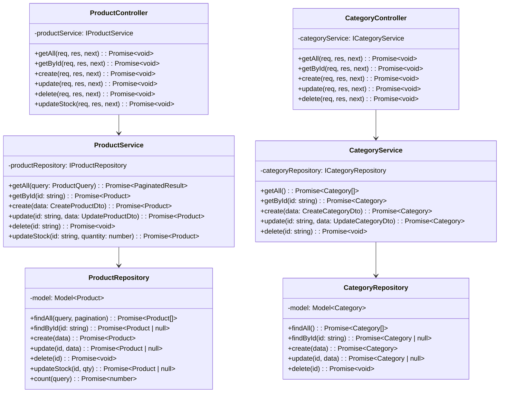

# Phase 2b — Product Service

**Durum:** NOT STARTED
**Tahmini Süre:** 1.5-2 gün
**Bağımlılık:** Phase 0 tamamlanmış, Phase 1 önerilir (Dispatcher proxy hazır)

---

## Hedef

Phase 2b bittiğinde:

- Ürün CRUD tam çalışıyor (create, read, update, delete)
- Kategori CRUD çalışıyor
- Ürün arama/filtreleme çalışıyor (isim, kategori, fiyat aralığı)
- Stok yönetimi çalışıyor (PATCH ile stok güncelleme — Dispatcher orchestration için)
- Pagination tüm liste endpoint'lerinde aktif
- Zod validasyon tüm input'larda aktif
- InternalAuthMiddleware dış istekleri engelliyor
- Test coverage >%60

---

## Ön Koşullar

- Phase 0: Servis scaffold'u hazır, docker-compose çalışıyor
- Phase 1: Dispatcher routing `/api/products/*` ve `/api/categories/*` tanımlı

---

## Adımlar

### Adım 2b.1: Category Model + Repository

**Dosyalar:**
```
services/product-service/src/interfaces/category.interface.ts
services/product-service/src/models/category.model.ts
services/product-service/src/interfaces/category-repository.interface.ts
services/product-service/src/repositories/category.repository.ts
```

- ICategory interface
- Category Mongoose schema + model
- ICategoryRepository interface (findAll, findById, create, update, delete)
- CategoryRepository class

### Adım 2b.2: Product Model + Repository

**Dosyalar:**
```
services/product-service/src/interfaces/product.interface.ts
services/product-service/src/models/product.model.ts
services/product-service/src/interfaces/product-repository.interface.ts
services/product-service/src/repositories/product.repository.ts
```

- IProduct interface
- Product Mongoose schema + model
- IProductRepository interface (findAll, findById, create, update, delete, updateStock, search)
- ProductRepository class

### Adım 2b.3: Service Katmanı

**Dosyalar:**
```
services/product-service/src/interfaces/category-service.interface.ts
services/product-service/src/services/category.service.ts
services/product-service/src/interfaces/product-service.interface.ts
services/product-service/src/services/product.service.ts
```

- ICategoryService, CategoryService (CRUD)
- IProductService, ProductService:
  - CRUD operasyonları
  - Arama/filtreleme (isim, kategori, fiyat aralığı)
  - Stok güncelleme (qty artır/azalt)
  - Pagination desteği

### Adım 2b.4: Controller + Validators

**Dosyalar:**
```
services/product-service/src/controllers/product.controller.ts
services/product-service/src/controllers/category.controller.ts
services/product-service/src/validators/product.validator.ts
services/product-service/src/validators/category.validator.ts
```

**Zod şemaları:**

```typescript
// Product
createProductSchema: {
  name: z.string().min(2),
  description: z.string().optional(),
  price: z.number().positive(),
  stock: z.number().int().min(0),
  categoryId: z.string().optional(),
  imageUrl: z.string().url().optional()
}

updateProductSchema: {
  name: z.string().min(2).optional(),
  description: z.string().optional(),
  price: z.number().positive().optional(),
  stock: z.number().int().min(0).optional(),
  categoryId: z.string().optional(),
  imageUrl: z.string().url().optional()
}

updateStockSchema: {
  quantity: z.number().int()  // negatif = azalt, pozitif = artır
}

productQuerySchema: {
  page: z.number().int().positive().default(1),
  limit: z.number().int().positive().max(100).default(10),
  search: z.string().optional(),
  categoryId: z.string().optional(),
  minPrice: z.number().min(0).optional(),
  maxPrice: z.number().min(0).optional(),
  sortBy: z.enum(['name', 'price', 'createdAt']).default('createdAt'),
  sortOrder: z.enum(['asc', 'desc']).default('desc')
}

// Category
createCategorySchema: {
  name: z.string().min(2),
  description: z.string().optional()
}

updateCategorySchema: {
  name: z.string().min(2).optional(),
  description: z.string().optional()
}
```

### Adım 2b.5: Routes

**Dosyalar:**
```
services/product-service/src/routes/product.routes.ts
services/product-service/src/routes/category.routes.ts
```

### Adım 2b.6: Testler

**Dosyalar:**
```
services/product-service/__tests__/product.service.test.ts
services/product-service/__tests__/product.routes.test.ts
services/product-service/__tests__/category.service.test.ts
services/product-service/__tests__/category.routes.test.ts
```

**Test senaryoları:**

```typescript
describe('Product Service', () => {
  describe('CRUD', () => {
    it('should create a product', ...);
    it('should get product by id', ...);
    it('should update product', ...);
    it('should delete product', ...);
    it('should list products with pagination', ...);
  });

  describe('search & filter', () => {
    it('should search products by name', ...);
    it('should filter by category', ...);
    it('should filter by price range', ...);
    it('should combine search and filters', ...);
  });

  describe('stock management', () => {
    it('should increase stock', ...);
    it('should decrease stock', ...);
    it('should return 400 when stock would go below zero', ...);
  });

  describe('error scenarios', () => {
    it('should return 404 when product not found', ...);
    it('should return 400 when price is negative', ...);
    it('should return 400 when required fields missing', ...);
  });
});

describe('Category Service', () => {
  it('should create category', ...);
  it('should list categories', ...);
  it('should update category', ...);
  it('should delete category', ...);
  it('should return 409 when duplicate category name', ...);
});
```

---

## Veritabanı Modeli

**Database:** `product_db`

**Collection: `products`**

| Alan | Tip | Zorunlu | Açıklama |
|------|-----|---------|----------|
| _id | ObjectId | Auto | |
| name | String | Evet | Text index (arama için) |
| description | String | Hayır | |
| price | Number | Evet | min: 0 |
| stock | Number | Evet | min: 0, default: 0 |
| categoryId | ObjectId | Hayır | ref: categories |
| imageUrl | String | Hayır | |
| isActive | Boolean | Evet | default: true |
| createdAt | Date | Auto | Mongoose timestamps |
| updatedAt | Date | Auto | Mongoose timestamps |

**Index'ler:**
- `{ name: "text" }` — Metin araması
- `{ categoryId: 1 }` — Kategoriye göre filtreleme
- `{ price: 1 }` — Fiyata göre sıralama
- `{ isActive: 1 }` — Aktif ürünleri filtreleme

**Collection: `categories`**

| Alan | Tip | Zorunlu | Açıklama |
|------|-----|---------|----------|
| _id | ObjectId | Auto | |
| name | String | Evet | Unique index |
| description | String | Hayır | |
| createdAt | Date | Auto | Mongoose timestamps |
| updatedAt | Date | Auto | Mongoose timestamps |

**Index'ler:**
- `{ name: 1 }` — Unique index

---

## API Endpoint'leri

### Product Endpoints

| Metot | İç Yol | Dış Yol (Dispatcher) | Durum Kodu | Auth |
|-------|--------|---------------------|------------|------|
| GET | /products | /api/products | 200 | Protected |
| GET | /products/:id | /api/products/:id | 200 | Protected |
| POST | /products | /api/products | 201 | Admin |
| PUT | /products/:id | /api/products/:id | 200 | Admin |
| DELETE | /products/:id | /api/products/:id | 204 | Admin |
| PATCH | /products/:id/stock | /api/products/:id/stock | 200 | Internal |

> **PATCH /products/:id/stock** Dispatcher orchestration tarafından çağrılır (sipariş oluşturma sırasında stok düşme/geri yükleme).

### Category Endpoints

| Metot | İç Yol | Dış Yol (Dispatcher) | Durum Kodu | Auth |
|-------|--------|---------------------|------------|------|
| GET | /categories | /api/categories | 200 | Protected |
| GET | /categories/:id | /api/categories/:id | 200 | Protected |
| POST | /categories | /api/categories | 201 | Admin |
| PUT | /categories/:id | /api/categories/:id | 200 | Admin |
| DELETE | /categories/:id | /api/categories/:id | 204 | Admin |

**Query Parametreleri (GET /products):**

| Parametre | Tip | Default | Açıklama |
|-----------|-----|---------|----------|
| page | number | 1 | Sayfa numarası |
| limit | number | 10 | Sayfa başına kayıt |
| search | string | — | İsim araması |
| categoryId | string | — | Kategori filtresi |
| minPrice | number | — | Minimum fiyat |
| maxPrice | number | — | Maximum fiyat |
| sortBy | string | createdAt | Sıralama alanı |
| sortOrder | string | desc | Sıralama yönü |

---

## Response Formatları

**GET /products — 200 OK (Paginated):**
```json
{
  "success": true,
  "data": [
    {
      "id": "64a...",
      "name": "Laptop",
      "description": "Gaming laptop",
      "price": 15000,
      "stock": 50,
      "categoryId": "64b...",
      "imageUrl": "https://...",
      "isActive": true,
      "createdAt": "2026-03-25T12:00:00Z"
    }
  ],
  "meta": {
    "page": 1,
    "limit": 10,
    "total": 50,
    "totalPages": 5
  }
}
```

**POST /products — 201 Created:**
```json
{
  "success": true,
  "data": {
    "id": "64a...",
    "name": "Laptop",
    "price": 15000,
    "stock": 50,
    "categoryId": "64b...",
    "isActive": true,
    "createdAt": "2026-03-25T12:00:00Z"
  }
}
```

**PATCH /products/:id/stock — 200 OK:**
```json
{
  "success": true,
  "data": {
    "id": "64a...",
    "name": "Laptop",
    "stock": 48,
    "previousStock": 50
  }
}
```

---

## Sınıf Diyagramı



---

## Quality Gate

- [ ] Product CRUD çalışıyor (GET, POST, PUT, DELETE)
- [ ] Category CRUD çalışıyor
- [ ] Arama çalışıyor (isim, kategori, fiyat aralığı)
- [ ] Pagination çalışıyor (meta: page, limit, total, totalPages)
- [ ] Stok güncelleme çalışıyor (PATCH /products/:id/stock)
- [ ] Stok negatife düşemez (400 Bad Request)
- [ ] Var olmayan ürün → 404 Not Found
- [ ] Zod validasyon hataları → 400 Bad Request
- [ ] Duplicate kategori ismi → 409 Conflict
- [ ] X-Internal-Key olmadan → 403 Forbidden
- [ ] Dispatcher üzerinden proxy çalışıyor
- [ ] TypeScript build hatasız (`tsc --noEmit`)
- [ ] `docker-compose up` ile servis ayağa kalkıyor
- [ ] Testler geçiyor, coverage >%60
- [ ] TODO/FIXME/HACK yok
- [ ] Dead code yok
- [ ] `any` type yok
- [ ] Servis dokümanı güncellendi: `docs/architecture/services/product-service.md`
- [ ] Route-map güncellemesi: `docs/architecture/api/route-map.md`

---

## İlgili Dokümanlar

- [Phase 1: Dispatcher](phase-1-dispatcher.md) (routing tablosu, orchestration)
- [API Conventions](../../.claude/rules/api-conventions.md)
- [Coding Standards](../../.claude/rules/coding-standards.md)
