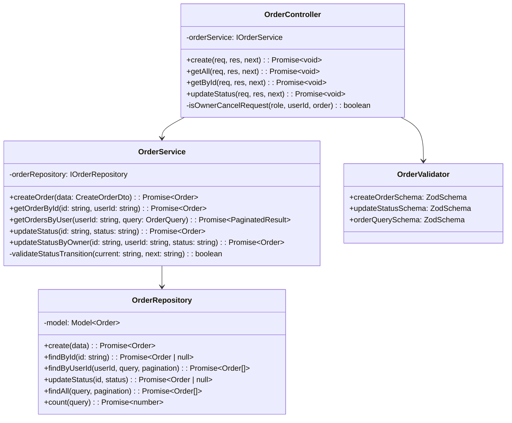

# Phase 2c — Order Service

**Durum:** NOT STARTED
**Tahmini Süre:** 1-1.5 gün
**Bağımlılık:** Phase 0 tamamlanmış, Phase 1 önerilir (Dispatcher orchestration hazır)

---

## Hedef

Phase 2c bittiğinde:

- Sipariş oluşturma çalışıyor (Dispatcher orchestration'dan gelen veri ile)
- Kullanıcının siparişleri listeleniyor (pagination)
- Sipariş detayı görüntüleniyor
- Sipariş durumu güncellenebiliyor (status transitions)
- Sipariş iptal edilebiliyor (sadece pending durumda)
- Zod validasyon tüm input'larda aktif
- InternalAuthMiddleware dış istekleri engelliyor
- Test coverage >%60

---

## Ön Koşullar

- Phase 0: Servis scaffold'u hazır, docker-compose çalışıyor
- Phase 1: Dispatcher orchestration (POST /api/orders) tanımlı

---

## Önemli Mimari Not — Orchestration Akışı

Order Service **basit bir CRUD servisidir**. Karmaşık sipariş oluşturma mantığı (stok kontrol, stok düşme) **Dispatcher'da** yapılır. Order Service'e gelen veriler zaten doğrulanmış ve zenginleştirilmiş haldedir.

```
İstemci → Dispatcher (orchestration):
  1. Product Service'ten stok kontrol
  2. Product Service'ten stok düş
  3. Order Service'e sipariş oluştur ← Burası Order Service'in işi
     (items, totalAmount, userId hazır gelir)
```

---

## Adımlar

### Adım 2c.1: Order Model + Repository

**Dosyalar:**
```
services/order-service/src/interfaces/order.interface.ts
services/order-service/src/models/order.model.ts
services/order-service/src/interfaces/order-repository.interface.ts
services/order-service/src/repositories/order.repository.ts
```

- IOrder, IOrderItem interfaces
- Order Mongoose schema + OrderItem sub-schema
- IOrderRepository interface (create, findById, findByUserId, updateStatus)
- OrderRepository class

**Sipariş Durum Geçişleri:**
```
pending → confirmed → shipped → delivered
pending → cancelled

Geçersiz geçişler: (hata → 400 Bad Request)
  confirmed → pending  (geri alınamaz)
  shipped → confirmed  (geri alınamaz)
  delivered → *         (son durum)
  cancelled → *         (son durum)
```

### Adım 2c.2: Order Service

**Dosyalar:**
```
services/order-service/src/interfaces/order-service.interface.ts
services/order-service/src/services/order.service.ts
```

- IOrderService interface
- OrderService class:
  - **createOrder:** Dispatcher'dan gelen hazır veri ile sipariş oluştur
  - **getOrderById:** Sipariş detayı (userId eşleşmesi kontrolü)
  - **getOrdersByUser:** Kullanıcının siparişleri (paginated)
  - **updateStatus:** Durum geçişi (geçerli mi kontrol et)
  - **updateStatus (owner cancel):** Owner pending → cancelled yapabilir (PATCH ile)

### Adım 2c.3: Controller + Validators

**Dosyalar:**
```
services/order-service/src/controllers/order.controller.ts
services/order-service/src/validators/order.validator.ts
```

**Zod şemaları:**

```typescript
createOrderSchema: {
  userId: z.string(),
  items: z.array(z.object({
    productId: z.string(),
    productName: z.string(),
    quantity: z.number().int().positive(),
    unitPrice: z.number().positive(),
    totalPrice: z.number().positive()
  })).min(1),
  totalAmount: z.number().positive(),
  shippingAddress: z.object({
    street: z.string(),
    city: z.string(),
    zip: z.string()
  }).optional()
}

updateStatusSchema: {
  status: z.enum(['confirmed', 'shipped', 'delivered', 'cancelled'])
}

orderQuerySchema: {
  page: z.number().int().positive().default(1),
  limit: z.number().int().positive().max(100).default(10),
  status: z.enum(['pending', 'confirmed', 'shipped', 'delivered', 'cancelled']).optional()
}
```

### Adım 2c.4: Routes

**Dosyalar:**
```
services/order-service/src/routes/order.routes.ts
```

### Adım 2c.5: Testler

**Dosyalar:**
```
services/order-service/__tests__/order.service.test.ts
services/order-service/__tests__/order.routes.test.ts
```

**Test senaryoları:**

```typescript
describe('Order Service', () => {
  describe('createOrder', () => {
    it('should create order with valid data', ...);
    it('should set initial status to pending', ...);
    it('should calculate totalAmount correctly', ...);
    it('should return 400 when items array is empty', ...);
  });

  describe('getOrderById', () => {
    it('should return order details', ...);
    it('should return 404 when order not found', ...);
  });

  describe('getOrdersByUser', () => {
    it('should return paginated orders for user', ...);
    it('should filter by status', ...);
    it('should not return other users orders', ...);
  });

  describe('updateStatus', () => {
    it('should update pending to confirmed', ...);
    it('should update confirmed to shipped', ...);
    it('should update shipped to delivered', ...);
    it('should return 400 for invalid transition (delivered to pending)', ...);
    it('should return 400 for invalid transition (cancelled to confirmed)', ...);
  });

  describe('owner cancel (via updateStatus)', () => {
    it('should allow owner to cancel own pending order', ...);
    it('should return 400 when owner tries to cancel non-pending order', ...);
    it('should return 403 when non-owner tries to cancel', ...);
  });
});
```

---

## Veritabanı Modeli

**Database:** `order_db`

**Collection: `orders`**

| Alan | Tip | Zorunlu | Açıklama |
|------|-----|---------|----------|
| _id | ObjectId | Auto | |
| userId | String | Evet | JWT'den gelen kullanıcı ID |
| items | Array&lt;OrderItem&gt; | Evet | Sipariş kalemleri (sub-document) |
| totalAmount | Number | Evet | Toplam tutar |
| status | String | Evet | enum: pending, confirmed, shipped, delivered, cancelled |
| shippingAddress | Object | Hayır | { street, city, zip } |
| createdAt | Date | Auto | Mongoose timestamps |
| updatedAt | Date | Auto | Mongoose timestamps |

**OrderItem Sub-Schema:**

| Alan | Tip | Zorunlu | Açıklama |
|------|-----|---------|----------|
| productId | String | Evet | Ürün ID (Product Service'ten) |
| productName | String | Evet | Ürün adı (snapshot — değişmez) |
| quantity | Number | Evet | Miktar |
| unitPrice | Number | Evet | Birim fiyat (snapshot) |
| totalPrice | Number | Evet | quantity × unitPrice |

> **Snapshot prensibi:** productName ve unitPrice sipariş anındaki değerleri saklar.
> Ürün fiyatı sonradan değişse bile sipariş kaydı etkilenmez.

**Index'ler:**
- `{ userId: 1, createdAt: -1 }` — Kullanıcının siparişleri (yeni önce)
- `{ status: 1 }` — Duruma göre filtreleme

---

## API Endpoint'leri

| Metot | İç Yol | Dış Yol (Dispatcher) | Durum Kodu | Auth |
|-------|--------|---------------------|------------|------|
| POST | /orders | /api/orders (orchestrated) | 201 | Internal (Dispatcher) |
| GET | /orders | /api/orders | 200 | Protected |
| GET | /orders/:id | /api/orders/:id | 200 | Protected |
| PATCH | /orders/:id/status | /api/orders/:id/status | 200 | Protected |

**GET /orders query parametreleri:**

| Parametre | Tip | Default | Açıklama |
|-----------|-----|---------|----------|
| page | number | 1 | Sayfa numarası |
| limit | number | 10 | Sayfa başına kayıt |
| status | string | — | Durum filtresi |

**Erişim kuralları (veri kapsamı — authorization değil, data scoping):**
- **GET /orders:** X-User-Id ile filtreleme (kullanıcı sadece kendi siparişlerini görür)
- **GET /orders/:id:** X-User-Id eşleşmesi (admin hariç — admin tümünü görebilir)
- **PATCH /orders/:id/status:**
  - Admin (X-User-Role=admin) → herhangi bir geçerli status geçişi yapabilir
  - Owner (X-User-Id eşleşir) → sadece pending → cancelled yapabilir (iptal)

> **Not:** Bu kurallar "authorization" değil "data scoping"dir. Yetkilendirme kararı
> (bu kullanıcı bu endpoint'e erişebilir mi?) **Dispatcher** tarafından verilir.
> Order Service sadece veriyi filtreler (X-User-Id ile) ve iş kuralını uygular
> (pending olmayan sipariş iptal edilemez).

---

## Response Formatları

**POST /orders — 201 Created:**
```json
{
  "success": true,
  "data": {
    "id": "64c...",
    "userId": "64a...",
    "items": [
      {
        "productId": "64b...",
        "productName": "Laptop",
        "quantity": 2,
        "unitPrice": 15000,
        "totalPrice": 30000
      }
    ],
    "totalAmount": 30000,
    "status": "pending",
    "createdAt": "2026-03-28T14:00:00Z"
  }
}
```

**GET /orders — 200 OK (Paginated):**
```json
{
  "success": true,
  "data": [ ... ],
  "meta": {
    "page": 1,
    "limit": 10,
    "total": 5,
    "totalPages": 1
  }
}
```

**PATCH /orders/:id/status — 200 OK:**
```json
{
  "success": true,
  "data": {
    "id": "64c...",
    "status": "confirmed",
    "previousStatus": "pending",
    "updatedAt": "2026-03-29T10:00:00Z"
  }
}
```

---

## Sınıf Diyagramı



---

## Quality Gate

- [ ] Sipariş oluşturma çalışıyor (POST /orders → 201)
- [ ] Kullanıcının siparişleri listeleniyor (GET /orders → pagination)
- [ ] Sipariş detayı görünüyor (GET /orders/:id → 200)
- [ ] Kullanıcı sadece kendi siparişlerini görebiliyor
- [ ] Status güncelleme çalışıyor (PATCH /orders/:id/status)
- [ ] Geçersiz status geçişi → 400 Bad Request
- [ ] Owner pending siparişini PATCH ile iptal edebiliyor (status → cancelled)
- [ ] Owner non-pending siparişi iptal edemiyor (400)
- [ ] Delivered/cancelled siparişler değiştirilemez
- [ ] Zod validasyon hataları → 400 Bad Request
- [ ] X-Internal-Key olmadan → 403 Forbidden
- [ ] Dispatcher orchestration ile entegre çalışıyor
- [ ] Snapshot prensibi: ürün adı ve fiyat sipariş anında sabitlenir
- [ ] TypeScript build hatasız (`tsc --noEmit`)
- [ ] `docker-compose up` ile servis ayağa kalkıyor
- [ ] Testler geçiyor, coverage >%60
- [ ] TODO/FIXME/HACK yok
- [ ] Dead code yok
- [ ] `any` type yok
- [ ] Servis dokümanı güncellendi: `docs/architecture/services/order-service.md`
- [ ] Route-map güncellemesi: `docs/architecture/api/route-map.md`

---

## İlgili Dokümanlar

- [Phase 1: Dispatcher](phase-1-dispatcher.md) (orchestration akışı, routing tablosu)
- [Phase 2b: Product Service](phase-2b-product-service.md) (stok güncelleme endpoint'i)
- [API Conventions](../../.claude/rules/api-conventions.md)
- [Coding Standards](../../.claude/rules/coding-standards.md)
